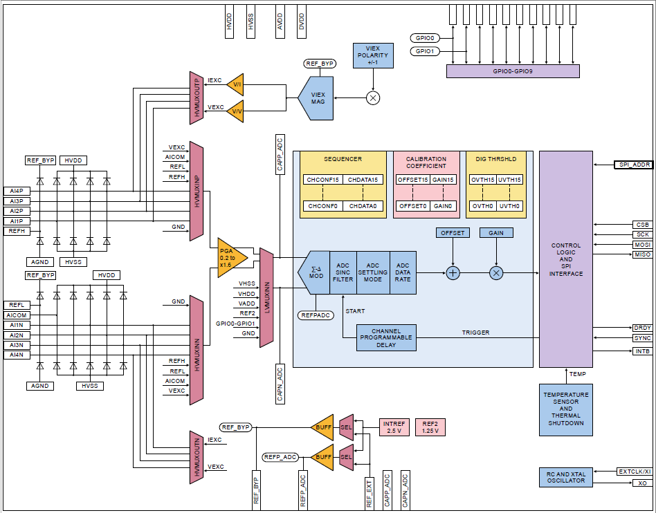

# NXP Application Code Hub

## NAFE13388-UIM (Analog Front End) Industrial Applications running on FRDM-MCXN947

 The NAFE13388 is a highly configurable, industrial-grade, multichannel universal input analog front-end (AFE) that meets high-precision measurement requirements. The device integrates low-leakage, high-voltage (HV) fast multiplexers,a low-offset and low-drift programmable gain amplifier (PGA) and buffers, high data-rate 24-bit sigma-delta analog-to-digital converter (SD-ADC), precise voltage and current excitation source, and a low-drift voltage reference. All of the HV analog pins are diode-protected internally for electromagnetic compatibility (EMC) and miswiring scenarios. The NAFE13388 is equipped with various diagnostics and supplies supervisory circuitry for condition monitoring and anomaly detection. Two precise calibration voltage sources are made available for ease of end-to-end system self-calibration and predictive maintenance. 

This codebase provides six applications of NAFE13388-UIM to test the different reading modes provided for ADC:
 <ul><li><b>Current sensing:</b> Reading a current across 220 ohm shunt resistor between AI4P-AI4N using single channel single reading conversion. </li><li><b>Voltage sensing:</b> Reading multiple voltages (single ended and differential) on different analog inputs using single channel single reading conversion.</li><li><b>Voltage sensing (MCMR):</b> Reading multiple voltages (single ended and differential) on different analog inputs using Multi Channels Multi Readings conversion.</li><li><b>RTD 2-wire:</b> Reading a voltage across an RTD thermal sensor excited by the internal VIEX, the conversion is performed using single channel continuous readings conversion. </li> <li><b>RTD 4-wire:</b> Reading a voltage across an RTD thermal sensor excited by the internal VIEX, the conversion is performed using single channel continuous readings conversion. </li> <li><b>Weight scale (load cell):</b> Calibration and reading procedure of a load cell, the load cell excitation is generated by the NAFE integrated VIEX, the conversion is performed using single channel continuous readings conversion </li></ul>

### NAFE13388 block diagram

### Key features of NAFE13388-UIM (analog front-end)

- Eight configurable HV inputs
    - Single-ended or differential, with ranges up to ±25 V
    - Independent configurations for voltage, current, resistance, resistance temperature detector (RTD)
    - Overvoltage protected up to ±36 V for less than
- Programmable gain: x0.2 to x16
- Fast data rates (7.5 SPS to 288 kSPS)
- High accuracy
- System calibration
    - End-to-end calibration with integrated precise voltage sources
    - Accurate factory-calibrated products available
- ±3 ⁰C internal temperature sensor
- Precise excitation voltage and current sources
- Diagnostic system for faults detection and prediction
- 32 MHz SPI interface
- Power supply: HV: ±7 V to ±24 V, LV: 3.3 V
- Robust 7.5 kV HBM ESD and IEC61000-4-5 2 kV surge protection

### Key concepts related to NAFE13388-UIM (analog front-end)

- Some common ADC terminologies:
    - 
<b>Sigma-Delta ADC:</b> A SD-ADC oversamples the input signal at a high frequency, filters noise using a modulator, and then decimates the signal to a lower frequency for accurate conversion. It provides high resolution and accuracy, ideal for low-frequency signals in precision applications such as sensors and audio systems. 

    - 
<b>SINC filter:</b> An ADC sinc filter is a low-pass digital filter commonly used in SD ADCs to remove high-frequency noise. It smoothes the output by averaging, reducing quantization errors and providing a clean, accurate digital representation of the analog input. 

    - 
<b>Settling mode:</b> In ADC settling mode, <b>normal settling </b> allows multiple conversions for the input to stabilize before providing a valid result, ensuring accuracy over time. <b>Single-cycle settling</b> completes the conversion within one cycle, offering faster results but with potential for reduced accuracy if the input hasn’t fully stabilized. 

    - 
<b>ADC data rate:</b> ADC data rate refers to the speed at which an Analog-to-Digital Converter samples and converts an analog signal into digital output, typically measured in samples per second (SPS). A higher data rate allows faster signal processing, but may reduce resolution or increase noise, impacting accuracy in some applications. 

    - 
<b>Programmable channel delay:</b> A Programmable channel delay in ADC systems allows users to set specific time delays between sampling different input channels. This feature helps synchronize data acquisition, manage timing differences, or compensate for signal delays in multi-channel systems, improving measurement accuracy and system flexibility in complex signal processing applications.

    - 
<b>Programmable gain amplifiers:</b> Programmable Gain Amplifiers (PGAs) are amplifiers with adjustable gain settings, allowing users to dynamically control the amplification of input signals. PGAs improve signal resolution by amplifying weak signals before analog-to-digital conversion, making them ideal for applications requiring variable signal amplification, such as sensor interfacing and data acquisition systems.

    - 
<b>V/I excitation:</b> Voltage or current excitation refers to the external electrical stimulus applied to sensors or transducers for measurement. <b>Voltage excitation </b> provides a stable voltage source, while <b>current excitation </b> supplies a constant current. Both methods ensure accurate readings from resistive or active sensors in applications like strain gauges (load cell) and RTDs.

    - 
 <b>Single-ended signals:</b> A single-ended input measures the voltage difference between a wire and the ground. This difference is then amplified to provide the output.Single-ended inputs can suffer from noise as the wire that carries the signal picks up electrical background noise. The signal on a single-ended input could also be subject to ground loops.

    - 
<b>Differential signals: </b>A differential input has no reference to ground. Rather, the differential input carries the signal on two wires, a (+) signal wire and a (-) signal wire. The output value is the difference between the signals on the two wires (common mode rejection). Notice the output eliminates the noise and the desired signal doubles. This is because the signal on the (+) wire will be the opposite of the signal on the (-) wire (because the signal on the (-) wire is being multiplied by -1). Therefore, by subtracting the (-) signal wire from the (+) signal wire, the desired signal doubles. 

    - 
<b>REFH and REFL:</b> REFH and REFL provide stable and accurate voltage sources derived from VREF_BYP. REFH and REFL are 92 % and 8 %, of VREF_BYP, with a nominal value of 2.3 V and 0.2 V, respectively. 

- <b>Channel configuration registers:</b> CH_CONFIG0, CH_CONFIG1, CH_CONFIG2, and CH_CONFIG3.
    - <b> CH_CONFIG0 (0x20h) </b>
        - 
Select input channel, either high voltage (HV_AIP/HV_AIN, HV_SEL=1) or low voltage (LVSIG_IN[2:0],HV_SEL = 0). 

        - 
Select one of the eight channel gains if high-voltage input is selected. (0.2x to 16x). 

        - 
Disable/Enable the channel temperature coefficients correction (TCC_OFF = 1). 

    - <b> CH_CONFIG1 (0x21h) </b>
        - 
Set the pointer (CH_CAL_GAIN_OFFSET[3:0]) to select one of the 16 calibrated gain and offset coefficient pairs in the calibrated channel coefficient registers: GAIN_COEF0…15 and OFFSET_COEF0…15. 

        - 
Set the pointer (CH_THRS[3:0]) to select one of the 16 channel over- and under-range threshold pairs. 

        - 
Select one of 29 possible data rates: ADC_DATA_RATE[4:0]

        - Select one of the five possible filter options for second-stage SINC filter: ADC_SINC[2:0]
    - <b> CH_CONFIG2 (0x22h) </b>
        - 
Select one of the 64 possible preset channel delays before ADC start conversion: CH_DELAY[5:0]. 

        - 
Select ADC Settling mode, single-cycle, or normal: ADC_NORMAL_ SETTLING. 

        - 
Select to reset ADC digital filters at the start of every ADC conversion: ADC_FILTER_RESET. 

        - 
Select to enable input channel level chopping with two ADC conversions (Precision mode): CH_CHOP = 1. 

    - <b> CH_CONFIG3 (0x23h) </b>
        - 
Select excitation source: voltage or current (V/I).
        - 
 Select V/I polarity: positive or negative. 

        - Excitation V/I source magnitude 4 bits. 

        - 
 Enable voltage source to direct route to HVMUX as one of the selectable inputs for ADC conversion. 

        - 
Enable 65 nA source current for open detection. 

        - 
Enable VIEX chopping with two conversions (see VIEX_CHOP section). 

        - 
Select one of the AIxP or AIxN pins for excitation V/I output. 

- <b> NAFE13388 Reading (conversion) modes:</b>
    - 
<b>SCSR conversion:</b> The single channel single reading (SCSR) conversion of the NAFE13388 involves configuring the device to acquire data from a single channel at a time, with only one reading per conversion cycle. It is useful for applications requiring precise measurements without continuous monitoring. This mode enhances control, minimizing resource use. 

    - 
<b>MCMR conversion:</b> multi channel multi reading (MCMR) conversion of the NAFE13388 acquires data from multiple channels with multiple readings per channel in a single cycle. This is typically used in systems requiring multiple measurements across several channels in a single cycle for redundancy or averaging purposes. 

    - 
<b>SCCR conversion:</b> Single channel continuous reading (SCCR) conversion of the NAFE13388 involves continuous sampling from a single channel. This mode provides ongoing data acquisition, making it ideal for applications requiring constant monitoring of a sensor or signal, such as temperature or pressure measurements, where real-time data updates are essential. 

    - 
<b>MCSR conversion:</b> Multi channel single reading (MCSR) conversion of the NAFE13388 allows sequential data acquisition from multiple channels, with each channel sampled once per conversion cycle. This method is useful in applications where different sensor inputs need to be read in turn, ensuring data from multiple sources are captured efficiently without continuous monitoring.

    
    - 
<b>MCCR conversion: </b>Multi channel continuous reading (MCCR) conversion of the NAFE13388 continuously samples data from multiple channels simultaneously. It is ideal for applications that require real-time monitoring of several signals, such as multi-sensor systems, where each channel provides constant updates, allowing for comprehensive and simultaneous data acquisition across multiple inputs.

       
#### Boards: FRDM-MCXN947
#### Categories: Sensor, Industrial
#### Peripherals: DMA, GPIO, SENSOR, SPI, TIMER, UART
#### Toolchains: MCUXpresso IDE

## Table of Contents
1. [Hardware](#hardware)
2. [Applications Examples](#applications-examples) 
   2.1 [Command Line Interface](#command-line-inteface) 
   2.2 [Graphical User Interface](#graphical-user-interface) 
3. [FAQs](#faqs) 
4. [Support](#support)
5. [Release Notes](#release-notes)

## 1. Hardware

The needed hardware are:
* Power supply of 15 V or 15 V Adapter.
* USB cable.
* Jumper wires
* FRDM-MCXN947 Base Board
* NAFE13388-UIM Shield Board (*analog front-end*)
* 4-wire RTD Sensor ( *RTD 2/4-wire applications*).
* 220 ohm resistor (*current sensing application*).
* Load cell (*weight-scale application*).
* External power supply in order to try different voltage readings (*voltage-sensing application*).

**Hardware connections details**
- SGM3209YS8G/TR IC U20 (J90 1x2)
The SGM3209 is a charge pump voltage converter which is used to generate a negative supply from a positive input.
J90(1*2). It generates -15 V when we apply +15 V using external voltage source.

    - JUMPER (default) = CLOSED
    - OUTPUT pin of IC U20
    - -15 V

- AICOM - J91 (CLOSED)

- Analog inputs: For analog inputs use jumpers J82 and J83.

- External voltage source -> J89 1- GND 2- +15 V

**Note**: For ADC conversions: Connect analog input pins AIxP/AIxN-AICOM connect positive end to the AIxP/AIxN of J82/J83 as required and negative end to GND/AIxN.

- In order to completely understand all the applications in detail, kindly go thorugh entire <b>README.md </b>
- Refer to below application notes for theoretical understanding of each applications.
    - [AN14102](https://www.nxp.com/docs/en/application-note/AN14102.pdf) Industrial application measurements using NXP AFE.
    - [AN14103](https://www.nxp.com/docs/en/application-note/AN14103.pdf) NAFE applications with MCUXpresso.

## 2. Applications examples

Below are the links for CLI applications README and GUI applications README containing all the steps required to execute the applications:

### 2.1 Command line interface 

For Non-CMSIS based command line applications, documentation and steps refer README_CLI.md

- [CLI README (Non-CMSIS)](./examples_CLI/README_CLI.md)

For CMSIS based command line applications, documentation and steps refer README_CLI.md

- [CLI README (CMSIS)](./examples_CLI_CMSIS/README_CLI.md)

Note: CLI README remains same for both the applications as command line interface is same for both CMSIS and non CMSIS compliant applications.

### 2.2 Graphical user interface 

For GUI applications, documentation and steps refer README_CLI.md

- [GUI README](./examples_GUI/README_GUI.md)

## 3. FAQs
No FAQs have been identified for this project.

## 4. Support
* [NAFEx3388 Highly Configurable 8 Channel �25 V Universal Input Analog Front-End with Excitation Sources](https://www.nxp.com/products/analog-and-mixed-signal/analog-front-end/highly-configurable-8-channel-25-v-universal-input-analog-front-end-with-excitation-sources:NAFEx3388)

#### Project Metadata

<!----- Boards ----->

<!----- Categories ----->

<!----- Peripherals ----->

<!----- Toolchains ----->

Questions regarding the content/correctness of this example can be entered as issues within this gitHub repository.

>**Note**: For more general technical questions regarding NXP Microcontrollers and the difference in expected functionality, enter your questions on the [NXP Community Forum](https://community.nxp.com/)

## 5. Release Notes
| Version | Description / Update                           | Date                        |
|:-------:|------------------------------------------------|----------------------------:|
| 1.0     | Initial release on Application Code Hub        | September 28th 2024 |
| 1.1     | Updated Image for Voltage Sensing (SCSR,MCMR)  | October 21th 2024 |
| 2.0     | Added GUI based application to run different scenarios of NAFE13388  | October 25th 2024 |
| 3.0     | In GUI, Added Calibration Tab, On-Board RTD in applications tab. In CLI, Added CMSIS compliant SDK and applications | December 18th 2024 |
