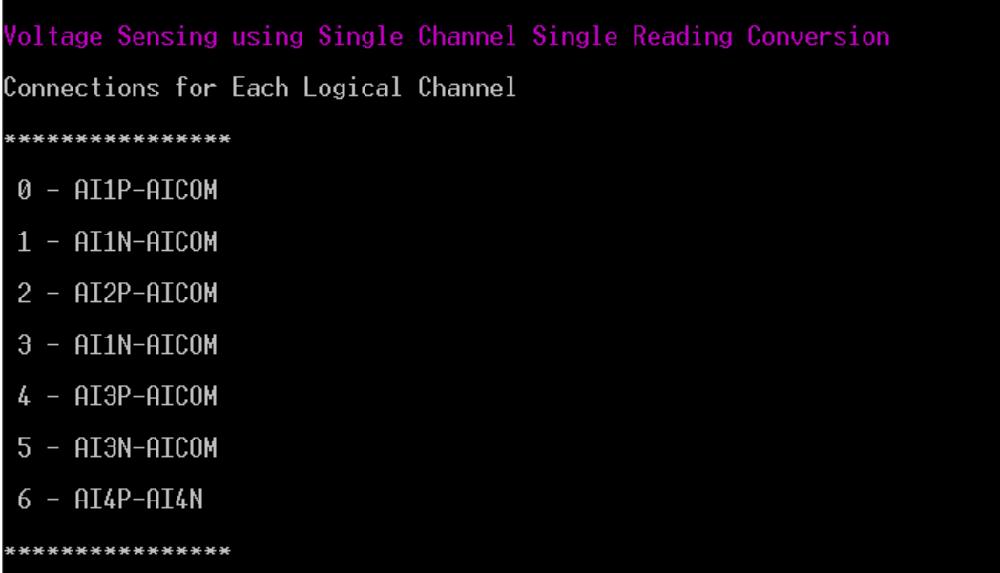
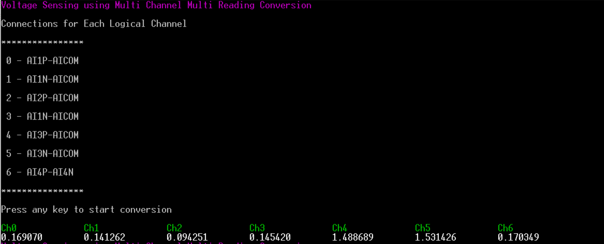
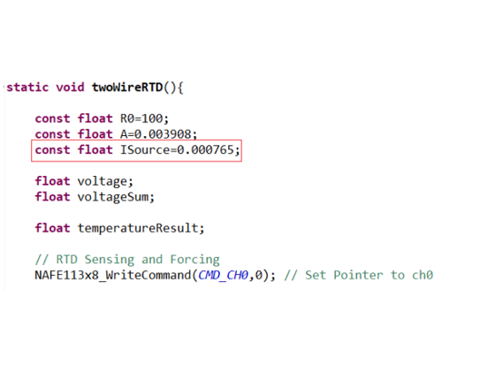
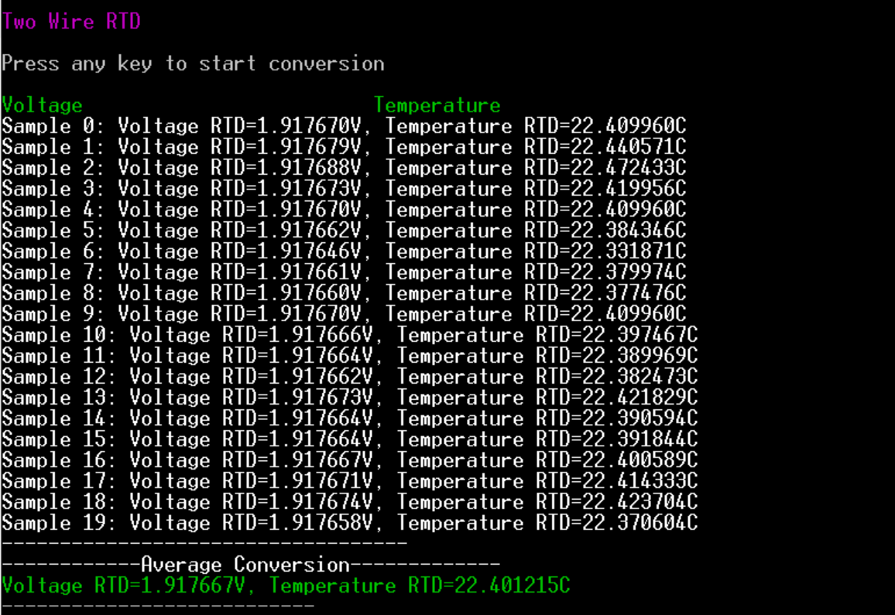
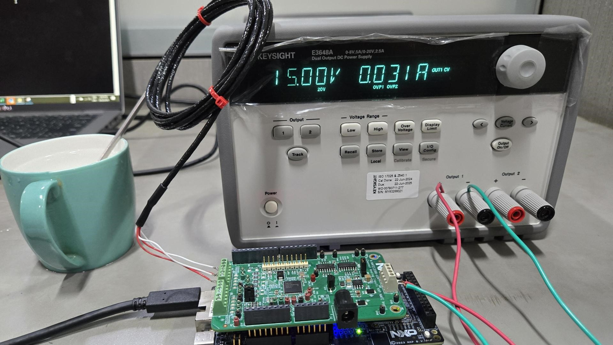

# NXP Application Code Hub

## NAFE13388-UIM (Analog Front End) Industrial Applications running on FRDM-MCXN947

 The NAFE13388 is a highly configurable, industrial-grade, multichannel universal input analog front-end (AFE) that meets high-precision measurement requirements. The device integrates low-leakage, high-voltage (HV) fast multiplexers,a low-offset and low-drift programmable gain amplifier (PGA) and buffers, high data-rate 24-bit sigma-delta analog-to-digital converter (SD-ADC), precise voltage and current excitation source, and a low-drift voltage reference. All of the HV analog pins are diode-protected internally for electromagnetic compatibility (EMC) and miswiring scenarios. The NAFE13388 is equipped with various diagnostics and supplies supervisory circuitry for condition monitoring and anomaly detection. Two precise calibration voltage sources are made available for ease of end-to-end system self-calibration and predictive maintenance. 

This codebase provides six applications of NAFE13388-UIM to test the different reading modes provided for ADC:
 <ul><li><b>Current sensing:</b> Reading a current across 220 ohm shunt resistor between AI4P-AI4N using single channel single reading conversion. </li><li><b>Voltage sensing:</b> Reading multiple voltages (single ended and differential) on different analog inputs using single channel single reading conversion.</li><li><b>Voltage sensing (MCMR):</b> Reading multiple voltages (single ended and differential) on different analog inputs using Multi Channels Multi Readings conversion.</li><li><b>RTD 2-wire:</b> Reading a voltage across an RTD thermal sensor excited by the internal VIEX, the conversion is performed using single channel continuous readings conversion. </li> <li><b>RTD 4-wire:</b> Reading a voltage across an RTD thermal sensor excited by the internal VIEX, the conversion is performed using single channel continuous readings conversion. </li> <li><b>Weight scale (load cell):</b> Calibration and reading procedure of a load cell, the load cell excitation is generated by the NAFE integrated VIEX, the conversion is performed using single channel continuous readings conversion </li></ul>

### NAFE13388 block diagram

### Key features of NAFE13388-UIM (analog front-end)

- Eight configurable HV inputs
    - Single-ended or differential, with ranges up to ±25 V
    - Independent configurations for voltage, current, resistance, resistance temperature detector (RTD)
    - Overvoltage protected up to ±36 V for less than
- Programmable gain: x0.2 to x16
- Fast data rates (7.5 SPS to 288 kSPS)
- High accuracy
- System calibration
    - End-to-end calibration with integrated precise voltage sources
    - Accurate factory-calibrated products available
- ±3 ⁰C internal temperature sensor
- Precise excitation voltage and current sources
- Diagnostic system for faults detection and prediction
- 32 MHz SPI interface
- Power supply: HV: ±7 V to ±24 V, LV: 3.3 V
- Robust 7.5 kV HBM ESD and IEC61000-4-5 2 kV surge protection

### Key concepts related to NAFE13388-UIM (analog front-end)

- Some common ADC terminologies:
    - 
<b>Sigma-Delta ADC:</b> A SD-ADC oversamples the input signal at a high frequency, filters noise using a modulator, and then decimates the signal to a lower frequency for accurate conversion. It provides high resolution and accuracy, ideal for low-frequency signals in precision applications such as sensors and audio systems. 

    - 
<b>SINC filter:</b> An ADC sinc filter is a low-pass digital filter commonly used in SD ADCs to remove high-frequency noise. It smoothes the output by averaging, reducing quantization errors and providing a clean, accurate digital representation of the analog input. 

    - 
<b>Settling mode:</b> In ADC settling mode, <b>normal settling </b> allows multiple conversions for the input to stabilize before providing a valid result, ensuring accuracy over time. <b>Single-cycle settling</b> completes the conversion within one cycle, offering faster results but with potential for reduced accuracy if the input hasn’t fully stabilized. 

    - 
<b>ADC data rate:</b> ADC data rate refers to the speed at which an Analog-to-Digital Converter samples and converts an analog signal into digital output, typically measured in samples per second (SPS). A higher data rate allows faster signal processing, but may reduce resolution or increase noise, impacting accuracy in some applications. 

    - 
<b>Programmable channel delay:</b> A Programmable channel delay in ADC systems allows users to set specific time delays between sampling different input channels. This feature helps synchronize data acquisition, manage timing differences, or compensate for signal delays in multi-channel systems, improving measurement accuracy and system flexibility in complex signal processing applications.

    - 
<b>Programmable gain amplifiers:</b> Programmable Gain Amplifiers (PGAs) are amplifiers with adjustable gain settings, allowing users to dynamically control the amplification of input signals. PGAs improve signal resolution by amplifying weak signals before analog-to-digital conversion, making them ideal for applications requiring variable signal amplification, such as sensor interfacing and data acquisition systems.

    - 
<b>V/I excitation:</b> Voltage or current excitation refers to the external electrical stimulus applied to sensors or transducers for measurement. <b>Voltage excitation </b> provides a stable voltage source, while <b>current excitation </b> supplies a constant current. Both methods ensure accurate readings from resistive or active sensors in applications like strain gauges (load cell) and RTDs.

    - 
 <b>Single-ended signals:</b> A single-ended input measures the voltage difference between a wire and the ground. This difference is then amplified to provide the output.Single-ended inputs can suffer from noise as the wire that carries the signal picks up electrical background noise. The signal on a single-ended input could also be subject to ground loops.

    - 
<b>Differential signals: </b>A differential input has no reference to ground. Rather, the differential input carries the signal on two wires, a (+) signal wire and a (-) signal wire. The output value is the difference between the signals on the two wires (common mode rejection). Notice the output eliminates the noise and the desired signal doubles. This is because the signal on the (+) wire will be the opposite of the signal on the (-) wire (because the signal on the (-) wire is being multiplied by -1). Therefore, by subtracting the (-) signal wire from the (+) signal wire, the desired signal doubles. 

    - 
<b>REFH and REFL:</b> REFH and REFL provide stable and accurate voltage sources derived from VREF_BYP. REFH and REFL are 92 % and 8 %, of VREF_BYP, with a nominal value of 2.3 V and 0.2 V, respectively. 

- <b>Channel configuration registers:</b> CH_CONFIG0, CH_CONFIG1, CH_CONFIG2, and CH_CONFIG3.
    - <b> CH_CONFIG0 (0x20h) </b>
        - 
Select input channel, either high voltage (HV_AIP/HV_AIN, HV_SEL=1) or low voltage (LVSIG_IN[2:0],HV_SEL = 0). 

        - 
Select one of the eight channel gains if high-voltage input is selected. (0.2x to 16x). 

        - 
Disable/Enable the channel temperature coefficients correction (TCC_OFF = 1). 

    - <b> CH_CONFIG1 (0x21h) </b>
        - 
Set the pointer (CH_CAL_GAIN_OFFSET[3:0]) to select one of the 16 calibrated gain and offset coefficient pairs in the calibrated channel coefficient registers: GAIN_COEF0…15 and OFFSET_COEF0…15. 

        - 
Set the pointer (CH_THRS[3:0]) to select one of the 16 channel over- and under-range threshold pairs. 

        - 
Select one of 29 possible data rates: ADC_DATA_RATE[4:0]

        - Select one of the five possible filter options for second-stage SINC filter: ADC_SINC[2:0]
    - <b> CH_CONFIG2 (0x22h) </b>
        - 
Select one of the 64 possible preset channel delays before ADC start conversion: CH_DELAY[5:0]. 

        - 
Select ADC Settling mode, single-cycle, or normal: ADC_NORMAL_ SETTLING. 

        - 
Select to reset ADC digital filters at the start of every ADC conversion: ADC_FILTER_RESET. 

        - 
Select to enable input channel level chopping with two ADC conversions (Precision mode): CH_CHOP = 1. 

    - <b> CH_CONFIG3 (0x23h) </b>
        - 
Select excitation source: voltage or current (V/I).
        - 
 Select V/I polarity: positive or negative. 

        - Excitation V/I source magnitude 4 bits. 

        - 
 Enable voltage source to direct route to HVMUX as one of the selectable inputs for ADC conversion. 

        - 
Enable 65 nA source current for open detection. 

        - 
Enable VIEX chopping with two conversions (see VIEX_CHOP section). 

        - 
Select one of the AIxP or AIxN pins for excitation V/I output. 

- <b> NAFE13388 Reading (conversion) modes:</b>
    - 
<b>SCSR conversion:</b> The single channel single reading (SCSR) conversion of the NAFE13388 involves configuring the device to acquire data from a single channel at a time, with only one reading per conversion cycle. It is useful for applications requiring precise measurements without continuous monitoring. This mode enhances control, minimizing resource use. 

    - 
<b>MCMR conversion:</b> multi channel multi reading (MCMR) conversion of the NAFE13388 acquires data from multiple channels with multiple readings per channel in a single cycle. This is typically used in systems requiring multiple measurements across several channels in a single cycle for redundancy or averaging purposes. 

    - 
<b>SCCR conversion:</b> Single channel continuous reading (SCCR) conversion of the NAFE13388 involves continuous sampling from a single channel. This mode provides ongoing data acquisition, making it ideal for applications requiring constant monitoring of a sensor or signal, such as temperature or pressure measurements, where real-time data updates are essential. 

    - 
<b>MCSR conversion:</b> Multi channel single reading (MCSR) conversion of the NAFE13388 allows sequential data acquisition from multiple channels, with each channel sampled once per conversion cycle. This method is useful in applications where different sensor inputs need to be read in turn, ensuring data from multiple sources are captured efficiently without continuous monitoring.

    
    - 
<b>MCCR conversion: </b>Multi channel continuous reading (MCCR) conversion of the NAFE13388 continuously samples data from multiple channels simultaneously. It is ideal for applications that require real-time monitoring of several signals, such as multi-sensor systems, where each channel provides constant updates, allowing for comprehensive and simultaneous data acquisition across multiple inputs.

       
#### Boards: FRDM-MCXN947, FRDM-MCXA153
#### Categories: Sensor, Industrial
#### Peripherals: DMA, GPIO, SENSOR, SPI, TIMER, UART
#### Toolchains: MCUXpresso IDE

## Table of Contents
1. [Software](#software)
2. [Hardware](#hardware)
3. [Setup](#setup)
4. [Applications Overview and Test Results](#applications-overview-and-test-results) 
   4.1 [Voltage Sensing SCSR](#voltage-sensing-scsr) 
   4.2 [Voltage Sensing MCMR](#voltage-sensing-mcmr) 
   4.3 [Current Sensing SCSR](#current-sensing-scsr) 
   4.4 [Two Wire RTD SCCR](#two-wire-rtd-sccr) 
   4.5 [Four Wire RTD SCCR](#four-wire-rtd-sccr) 
   4.6 [Weight Scale SCCR](#weight-scale-sccr) 
5. [FAQs](#faqs) 
6. [Support](#support)
7. [Release Notes](#release-notes)

## 1. Software
- [IoT Sensing SDK (ISSDK) v1.8](https://nxp.com/iot-sensing-sdk) offered as middleware in MCUXpresso SDK for supported platforms
- [MCUXpresso IDE v11.9.0](https://www.nxp.com/design/design-center/software/development-software/mcuxpresso-software-and-tools-/mcuxpresso-integrated-development-environment-ide:MCUXpresso-IDE)

## 2. Hardware

The needed hardware are:
* Power supply of 15 V or 15 V Adapter.
* USB cable.
* Jumper wires
* FRDM-MCXN947 Base Board
* NAFE13388-UIM Shield Board (*analog front-end*)
* 4-wire RTD Sensor ( *RTD 2/4-wire applications*).
* 220 ohm resistor (*current sensing application*).
* Load cell (*weight-scale application*).
* External power supply in order to try different voltage readings (*voltage-sensing application*).

**Hardware connections details**

- SGM3209YS8G/TR IC U20 (J90 1x2)
The SGM3209 is a charge pump voltage converter which is used to generate a negative supply from a positive input.
J90(1*2). It generates -15 V when we apply +15 V using external voltage source.

    - JUMPER (default) = CLOSED
    - OUTPUT pin of IC U20
    - -15 V

- AICOM - J91 (CLOSED)

- Analog inputs: For analog inputs use jumpers J82 and J83.

- External voltage source -> J89 1- GND 2- +15 V

**Note**: For ADC conversions: Connect analog input pins AIxP/AIxN-AICOM connect positive end to the AIxP/AIxN of J82/J83 as required and negative end to GND/AIxN.

- In order to completely understand all the applications in detail, kindly go thorugh entire <b>README.md </b>
- Refer to below application notes for theoretical understanding of each applications.
    - [AN14102](https://www.nxp.com/docs/en/application-note/AN14102.pdf) Industrial application measurements using NXP AFE.
    - [AN14103](https://www.nxp.com/docs/en/application-note/AN14103.pdf) NAFE applications with MCUXpresso.

## 3. Setup
### 3.1 Step 1: Download and Install required Software(s)
- Install MCUXpresso IDE 11.9.0
- Download and Install [MCUXpresso SDK v2.14.0 for FRDM-MCXN947](https://mcuxpresso.nxp.com/en/builder?hw=FRDM-MCXN947). Make sure to select ISSDK  middleware while building SDK.
- Download and Install [MCUXpresso SDK v2.14.2 for FRDM-MCXA153](https://mcuxpresso.nxp.com/en/builder?hw=FRDM-MCXA153). Make sure to select ISSDK  middleware while building SDK.
- Install Git v2.39.0 (for cloning and running west commands).
- Install Putty/Teraterm for UART.
 
### 3.2 Step 2: Clone the APP-CODE-HUB/dm-nafe13388-application-examples
- Clone this repository to get the example projects:
- Change directory to cloned project folder: 
    cd *dm-nafe13388-application-examples*
 
**Note:** If using windows to clone the project, then please configure filename length limit using below command
**git config --system core.longpaths true**

### 3.3 Step 3: Build example projects
- Open MCUXpresso IDE and select a directory to create your workspace.
- Install MCXUpresso SDK 2.14.x for FRDM-MCX947 (drag and drop SDK zip into "Installed SDK" view) into MCUXpresso IDE.
- Go to "Quickstart Panel" and click on "Import Project(s) from file system".
- Select "Project directory (unpacked)" and browse to the cloned project folder.
- Select example projects that you want to open and run.
- Right click on project and select build to start building the project.

## 4. Applications overview and test results
- User needs to check the COM port after connecting USB cable between host PC and target board via device manager.

- Open PUTTY/Teraterm application installed on your Windows PC with Baudrate 115200 and assigned COM port as mentioned in above step.

- Right click on project and select "Debug As", Demo application will run in interactive mode. When the demo runs successfully, the logs gets printed on the terminal.

<h3><b> NAFE13388-UIM applications </b></h3> 

#### 4.1 Voltage sensing SCSR 

- 
Voltage sensing is performed for single-ended as well as differential signals using single channel single reading conversion. 

- 
 Test Scenario:A single ended (AIxP/AIxN-AICOM) or differential (AIxP-AIxN) voltage is applied using power supply on analog inputs and the inputs sense these voltage levels and provides results after analog to digital conversion. 

**Note:** Apply voltage on analog inputs keeping in mind HV input ranges supported by NAFE13388 IC by referring Electrical Characterestics chapter from NAFE13388 datasheet.

- Connect power supply to analog inputs according to this:
    - Logical channel 0 is configured for AI1P-AICOM (single-ended signal).
    - Logical channel 1 is configured for AI1N-AICOM (single-ended signal).
    - Logical channel 2 is configured for AI2P-AICOM (single-ended signal).
    - Logical channel 3 is again configured for AI1N-AICOM (single-ended signal). 
    - Logical channel 4 is configured for AI3P-AICOM (single-ended signal).
    - Logical channel 5 is configured for AI3N-AICOM (single-ended signal).
    - Logical channel 6 is configured for AI4P-AI4N (differential signal).
    
    

- Apply voltages in range according to the table below:

     

- Single-ended voltage sensing:
    - Connected AI1P-AICOM and AI2P-AICOM.

    - Conversion method followed: Single channel single reading conversion.

    - Applied +5 volts on AI1P-AICOM and +2.03 V on AI2P-AICOM using a power supply.

        

        

- Differential voltage sensing:
    - Connected AI4P-AI4N as shown in diagram

    - Conversion method followed: Single channel single reading conversion.

    - Applied +2.70 V on AI14P-AICOM and +2.53 V on AI4N-AICOM using a power supply. Calculation is performed as follows: AI4P-AI4N = 2.70-2.53 which is equal to 0.17 V.

        

        

#### 4.2 Voltage sensing MCMR 

- 
Voltage sensing is performed for single ended as well as differential signals using multi channel multi reading conversion. 

- 
 Test scenario:A single-ended (AIxP/AIxN-AICOM) or Differential (AIxP-AIxN) voltage is applied using power supply on analog inputs and these Inputs sense these voltage levels and provides results after analog to digital conversion. 

**Note:** Apply voltage on analog inputs keeping in mind HV input ranges supported by NAFE13388 IC by referring Electrical Characterestics chapter from NAFE13388 datasheet.

- Connect power supply to analog inputs according to this:
    - Logical channel 0 is configured for AI1P-AICOM (single-ended signal).
    - Logical channel 1 is configured for AI1N-AICOM (single-ended signal).
    - Logical channel 2 is configured for AI2P-AICOM (single-ended signal).
    - Logical channel 3 is again configured for AI1N-AICOM (single-ended signal). 
    - Logical channel 4 is configured for AI3P-AICOM (single-ended signal).
    - Logical channel 5 is configured for AI3N-AICOM (single-ended signal).
    - Logical channel 6 is configured for AI4P-AI4N (differential signal).

- Apply voltages in range according to the table below:

     

- Single-ended voltage sensing:
    - Connected AI1P-AICOM and AI2P-AICOM.

    - Conversion method followed: Multi channel multi reading conversion.

    - Applied +5 V on AI1P-AICOM and +2.03 V on AI2P-AICOM using a power supply.

        

        

- Differential voltage sensing:
    - Connected AI4P-AI4N as shown in diagram

    - Conversion method followed: Multi channel multi reading conversion.

    - Applied +2.70 V on AI14P-AICOM and +2.53 V on AI4N-AICOM using a power supply. Calculation is performed as follows: AI4P-AI4N = 2.70-2.53 which is equal to 0.17 V.

        

        

**Note:** MCMR is ideal for multi-channel applications where simultaneous monitoring of multiple signals is needed, abelit at the cost of complexity and potentially slower conversions while SCSR is more suited for single channel applications where speed and simplicity are prioritized.

#### 4.3 Current sensing SCSR 

- 
 Current sensing in the NAFE13388 works by using a small, precise resistor to measure how much current is flowing in a system. It converts the current into a voltage that the device can read. This method is accurate, reduces noise, and is commonly used for monitoring things like pressure in industrial systems. 

- 
 The NAFE13388 measures pressure using a pressure transmitter that converts pressure into a standard current signal, typically ranging from 4 mA to 20 mA. For example, 4 mA might represent 0 pressure, and 20 mA could represent maximum pressure (like 10 bars). The device reads the current through a precise resistor, converts it to a voltage, and then calculates the corresponding pressure based on the current value. This allows the system to accurately track changes in pressure. 

- Provide voltage to analog input AI4P-AI4N using a power supply.
- Connect resistance in series with voltage on AI4P-AI4N to measure current across AI4P-AI4N.
- Refer this table to set voltage and corresponding gains based on resistances used:
     
    

- Conversion method followed: Single channel single reading conversion.
- Connected voltage of +3 V using a power supply and also a resistance of 220 ohms in series with it to measure current across AI4P-AI4N which came out to be 0.014 A which can be seen on power supply output.

    

- Output current as calculated via SensedVoltage/Resistance is shown below:

    

#### 4.4 Two wire RTD SCCR 

- Reading voltage across two wire RTD powered by NAFE13388 VIEX using single channel continuous reading conversion.
- RTD stands for resistance temperature detectors.
- 
 A 2-wire RTD measures temperature by passing a current through a resistor that changes resistance with temperature. The voltage across the RTD is measured to calculate the resistance. In this setup, wire resistance can affect accuracy, making it best for short distances. 

- 
 The main drawback of a 2-wire RTD is reduced accuracy due to added resistance from the wires, affecting measurements. 

- 
 For more information about RTDs refer to this application note which covers all the theoretical and conceptual details about 2/3/4-wire RTDs: 

    [AN14127](https://www.nxp.com/docs/en/application-note/AN14127.pdf) RTD measurement system with NAFE13388/73388 family of devices.

- Connections guide for two-wire RTD:
    
    
	
    
- Provide 750uA current using NAFE13388 VIEX to AI1P.
- Connect AI1P-AICOM as follows:
    - Red wire of 2-wire RTD to AI1P which is used to force the current of 750uA and sense the voltage as well.
    - White wire of 2-wire RTD to AICOM as a current return path.
- 
 Measure current across AI1P-AICOM by connecting any wire or resistance on AI1P, Place red probe of multimeter on AI1P on which wire/resistance is connected and black probe to AICOM which is J91 on NAFE13388. 

- In this case, current came out to be 765.5 uA as shown in figure below, replace Isource with the actual value measured for accurate readings.

    

    
- We can use 4 wire RTD to calulate temperature for 2 wire RTD as well, connect any red wire to AI1P and any white wire to AICOM as shown below:

    - Readings at room temperature:

        

        

    - Readings when dipped in cold water:

        

        

- **Note:** A 3-wire RTD is better than a 2-wire RTD because it compensates for the resistance of the connecting wires, improving measurement accuracy by canceling out the effects of lead wire resistance, especially in longer distances.

- **Note**: Since the NAFE13388 silicon doesn't provide the support to excite two analog inputs pins from single excitation pin as needed so we will not show the use case of three wire RTDs and directly proceed with four wire RTDs.
#### 4.5 Four wire RTD SCCR 

- Reading voltage across four wire RTD powered by NAFE13388 VIEX using single channel continuous reading conversion.

- 
 Four-wire RTDs are the most accurate because they completely eliminate the effects of lead wire resistance. In this setup, two wires supply current while the other two measure the voltage across the RTD, with no current flowing through the measurement wires. This setup provides highly precise temperature readings, ideal for critical applications. 

 

- 
 Force 750 uA current on AI2P-AICOM which becomes the force path to make 4-wire RTD work and sense the voltage after ADC conversion across AI1P-AI1N using differential sensing mechanism. 

- 
 For more information about RTDs refer to this application note which covers all the theoretical and conceptual details about 2/3/4-wire RTDs: 

    
    [AN14127](https://www.nxp.com/docs/en/application-note/AN14127.pdf) RTD measurement system with NAFE13388/73388 family of devices.

- Connections guide for four wire RTD:

    

- Provide 750 uA current using NAFE13388 VIEX to AI2P-AICOM.
- Connect one red wire of RTD to AI2P and one white wire to AICOM which completes the current forcing path required to force 750 uA current to RTD.
- Connect other red wire of RTD to AI1P and other white wire to AI1N which is the differential voltage sensing path which is then used to calculate temperature according to the conversion formulae.
- 
 Measure current across AI2P-AICOM by connecting any wire or resistance on AI1P, Place red probe of multimeter on AI2P on which wire/resistance is connected and black probe to AICOM which is J91 on NAFE13388. 

- In this case, current came out to be 765.5 uA as shown in figure below, replace Isource with the actual value measured to get for accurate readings.

    

    
- Connections and Results are as follows:

    - Readings at room temperature:

        

        

    - Readings when dipped in cold water:

         

         
        
- **Note:** A 4-wire RTD is better because it eliminates the influence of lead wire resistance, providing more accurate temperature measurements. The difference of around 3°C between 2-wire and 4-wire RTDs arises because the 2-wire setup includes lead resistance in the measurement, causing higher temperature errors.
    
#### 4.6 Weight scale SCCR 

- 
  <b> Weight Cell (Load Cell): </b> Calibration and reading procedure of a load cell, the load cell excitation is generated by the NAFE integrated VIEX, the conversion is performed using single channel continuous readings conversion 

- 
A load cell is a transductor used to translate mechanical force, such as weight, into measurable quantity. Load cells are usually composed of a strain gauge positioned on an elastic element. The elastic element is usually made of steel, so it is strong, but also has some elasticity. The minute variations on the spring element can be detected with strain gauges. The strain of the strain gauge is then converted by the electronics (ADC + excitation circuit) to determine the weight. 

- 
 In a load cell, a wheatstone bridge structure is used to transform a resistance value to a voltage value. The wheatstone architecture utilizes a strain gauge in place of resistors. AI2P of the NAFE is used as output voltage, while AI1P and AI1N are used to sense the voltage across the bridge. 

     

- 
 This application needs a voltage excitation source and two input channels to sense the voltage. Use a slow data rate and a higher gain configuration to improve the quality of reading as the sense voltage range will be in the order of mV. 

- Connections guide for weighing scale:

    - 
 Connect red and black wires of the load cell to AI2P and AICOM respectively for forcing 6 volts excitation voltage to AI2P. 

    - 
 Connect AI1P-AI1N with green and white wires respectively to sense differential voltage acrross which is required for weight calculation. 

- 
 Need of 6 V excitation voltage: A 6 V excitation voltage is required for a load cell to provide a stable and consistent voltage to the strain gauges. This excitation voltage powers the strain gauges and ensures that any changes in their resistance due to applied force result in measurable voltage changes. Higher excitation voltage, like 6 V, improves the signal-to-noise ratio, enhancing the accuracy and resolution of the weight measurement. It also ensures the strain gauges operate within their optimal range for precise and reliable performance. 

- Three step process to calibrate and measure weight of any object:
   
    1. Offset calculation:Firstly, sense the voltage across load cell without putting any weight, resulting voltage should be stored as offset.
    2. Calibration coefficient calculation: Calibrate the load cell with known weight and store the value of calibration coefficient as follows:

        - calibrationCoeff = (knownWeight)/(ConversionResult-Offset)
    3. Now any weight can be measured, by voltage conversion read by the ADC (Vadc):
        
        - Weight = calibrationCoeff * (Vadc - Offset)

- Step 1: Offset calculation(without any weight):

    

    

- Step 2: Calculation of calibration coefficient by calibrating the weight scale with known weight (303g in this case):

    

    

    

- Step 3: Actual weights calculation (289g in this case):

    

    

## 5. FAQs
No FAQs have been identified for this project.

## 6. Support
* [NAFEx3388 Highly Configurable 8 Channel �25 V Universal Input Analog Front-End with Excitation Sources](https://www.nxp.com/products/analog-and-mixed-signal/analog-front-end/highly-configurable-8-channel-25-v-universal-input-analog-front-end-with-excitation-sources:NAFEx3388)

#### Project Metadata

<!----- Boards ----->

<!----- Categories ----->

<!----- Peripherals ----->

<!----- Toolchains ----->

Questions regarding the content/correctness of this example can be entered as issues within this gitHub repository.

>**Note**: For more general technical questions regarding NXP Microcontrollers and the difference in expected functionality, enter your questions on the [NXP Community Forum](https://community.nxp.com/)

## 7. Release Notes
| Version | Description / Update                           | Date                        |
|:-------:|------------------------------------------------|----------------------------:|
| 1.0     | Initial release on Application Code Hub        | September 28th 2024 |
| 2.0     | Updated Image for Voltage Sensing (SCSR,MCMR)  | October 21th 2024 |
