# NXP Application Code Hub

## Command Line Interface for running different applications of NAFE13388-UIM on FRDM-MCXN947

This document provides information about running different applications of analog front end on command line interface: 

- Voltage sensing (SCSR,MCMR)
- Current sensing
- 2-wire RTD
- 4-wire RTD
- Weight scale (load cell) 

## Table of Contents
1. [Software](#software)
2. [Setup](#setup)
3. [Applications Overview and Test Results](#applications-overview-and-test-results) 
   3.1 [Voltage Sensing SCSR](#voltage-sensing-scsr) 
   3.2 [Voltage Sensing MCMR](#voltage-sensing-mcmr) 
   3.3 [Current Sensing SCSR](#current-sensing-scsr) 
   3.4 [2-wire RTD SCCR](#2-wire-rtd-sccr) 
   3.5 [4-wire RTD SCCR](#4-wire-rtd-sccr) 
   3.6 [Weight scale SCCR](#weight-scale-sccr) 

## 1. Software
- [IoT Sensing SDK (ISSDK) v1.8](https://nxp.com/iot-sensing-sdk) offered as middleware in MCUXpresso SDK for supported platforms
- [MCUXpresso IDE v11.9.0](https://www.nxp.com/design/design-center/software/development-software/mcuxpresso-software-and-tools-/mcuxpresso-integrated-development-environment-ide:MCUXpresso-IDE)

## 2. Setup
### 2.1 Step 1: Download and Install required Software(s)
- Install MCUXpresso IDE 11.9.0
- Download and Install [MCUXpresso SDK v2.14.0 for FRDM-MCXN947](https://mcuxpresso.nxp.com/en/builder?hw=FRDM-MCXN947). Make sure to select ISSDK  middleware while building SDK.
- Install Git v2.39.0 (for cloning and running west commands).
- Install Putty/Teraterm for UART.
 
### 2.2 Step 2: Clone the APP-CODE-HUB/dm-nafe13388-application-examples
- Clone this repository to get the example projects:
- Change directory to cloned project folder: 
    cd *dm-nafe13388-application-examples*
 
**Note:** If using windows to clone the project, then please configure filename length limit using below command
**git config --system core.longpaths true**

### 2.3 Step 3: Build example projects
- **For flashing code, connect type-C cable to J17 of FRDM-MCXN947, which is a MCU-debug link port.** 
- Open MCUXpresso IDE and select a directory to create workspace.
- Install MCXUpresso SDK 2.14.x for FRDM-MCX947 (drag and drop SDK zip into "Installed SDK" view) into MCUXpresso IDE.
- Go to "Quickstart Panel" and click on "Import Project(s) from file system".
- Select "Project directory (unpacked)" and browse to the cloned project folder.
- Select an example project and run.
- Right click on project and select build to start building the project.

## 3. Applications overview and test results
- User needs to check the COM port after connecting USB cable between host PC and target board via device manager.

- Open PUTTY/Teraterm application installed on Windows PC with Baudrate 115200 and assigned COM port as mentioned in above step.

- Right click on project and select "Debug As", Demo application will run in interactive mode. When the demo runs successfully, the logs gets printed on the terminal.

<h3><b> NAFE13388-UIM applications </b></h3> 

#### 3.1 Voltage sensing SCSR 

- 
Voltage sensing is performed for single-ended as well as differential signals using single channel single reading conversion. 

- 
 Test Scenario:A single ended (AIxP/AIxN-AICOM) or differential (AIxP-AIxN) voltage is applied using power supply on analog inputs and the inputs sense these voltage levels and provides results after analog to digital conversion. 

**Note:** Apply voltage on analog inputs keeping in mind HV input ranges supported by NAFE13388 IC by referring Electrical Characterestics chapter from NAFE13388 datasheet.

- Connect power supply to analog inputs according to this:
    - Logical channel 0 is configured for AI1P-AICOM (single-ended signal).
    - Logical channel 1 is configured for AI1N-AICOM (single-ended signal).
    - Logical channel 2 is configured for AI2P-AICOM (single-ended signal).
    - Logical channel 3 is again configured for AI1N-AICOM (single-ended signal). 
    - Logical channel 4 is configured for AI3P-AICOM (single-ended signal).
    - Logical channel 5 is configured for AI3N-AICOM (single-ended signal).
    - Logical channel 6 is configured for AI4P-AI4N (differential signal).
    
    

- Apply voltages in range according to the table below:

     [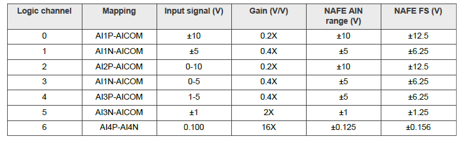](Voltage_Range_VS_MCMR_SCSR.PNG)

- Single-ended voltage sensing:
    - Connected AI1P-AICOM and AI2P-AICOM.

    - Conversion method followed: Single channel single reading conversion.

    - Applied +5 volts on AI1P-AICOM and +2.03 V on AI2P-AICOM using a power supply.

        [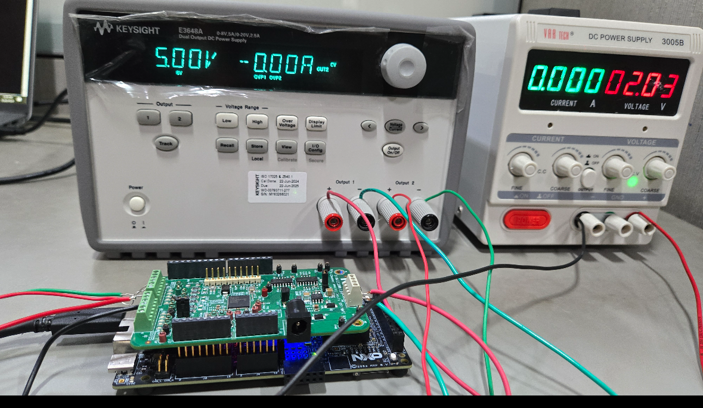](singleEnded_vs_scsr_mcmr_.png)

        [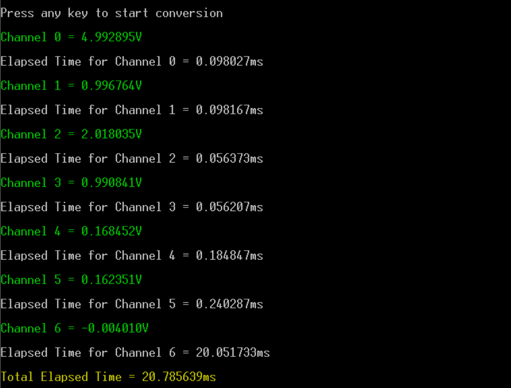](VoltageSensing_SCSR_2.PNG)

- Differential voltage sensing:
    - Connected AI4P-AI4N as shown in diagram

    - Conversion method followed: Single channel single reading conversion.

    - Applied +2.70 V on AI14P-AICOM and +2.53 V on AI4N-AICOM using a power supply. Calculation is performed as follows: AI4P-AI4N = 2.70-2.53 which is equal to 0.17 V.

        

        [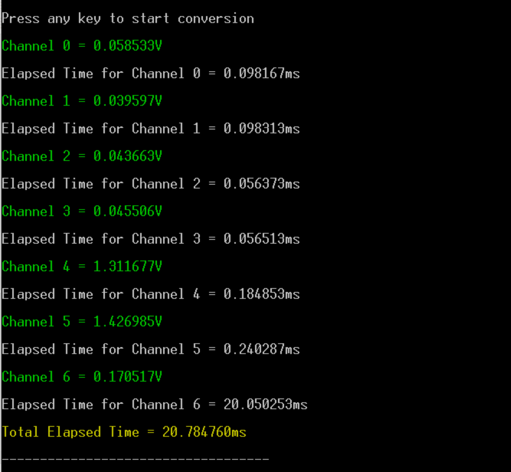](VoltageSensing_SCSR_2.PNG)

#### 3.2 Voltage sensing MCMR 

- 
Voltage sensing is performed for single ended as well as differential signals using multi channel multi reading conversion. 

- 
 Test scenario:A single-ended (AIxP/AIxN-AICOM) or Differential (AIxP-AIxN) voltage is applied using power supply on analog inputs and these Inputs sense these voltage levels and provides results after analog to digital conversion. 

**Note:** Apply voltage on analog inputs keeping in mind HV input ranges supported by NAFE13388 IC by referring Electrical Characterestics chapter from NAFE13388 datasheet.

- Connect power supply to analog inputs according to this:
    - Logical channel 0 is configured for AI1P-AICOM (single-ended signal).
    - Logical channel 1 is configured for AI1N-AICOM (single-ended signal).
    - Logical channel 2 is configured for AI2P-AICOM (single-ended signal).
    - Logical channel 3 is again configured for AI1N-AICOM (single-ended signal). 
    - Logical channel 4 is configured for AI3P-AICOM (single-ended signal).
    - Logical channel 5 is configured for AI3N-AICOM (single-ended signal).
    - Logical channel 6 is configured for AI4P-AI4N (differential signal).

- Apply voltages in range according to the table below:

     

- Single-ended voltage sensing:
    - Connected AI1P-AICOM and AI2P-AICOM.

    - Conversion method followed: Multi channel multi reading conversion.

    - Applied +5 V on AI1P-AICOM and +2.03 V on AI2P-AICOM using a power supply.

        

        [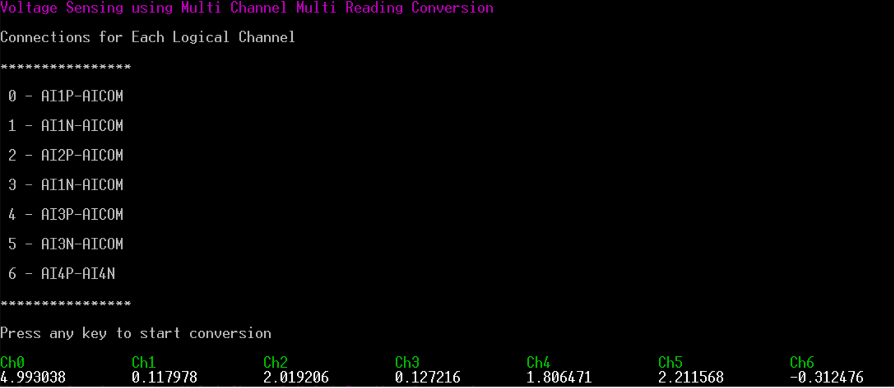](VoltageSensing_MCMR_1.PNG)

- Differential voltage sensing:
    - Connected AI4P-AI4N as shown in diagram

    - Conversion method followed: Multi channel multi reading conversion.

    - Applied +2.70 V on AI14P-AICOM and +2.53 V on AI4N-AICOM using a power supply. Calculation is performed as follows: AI4P-AI4N = 2.70-2.53 which is equal to 0.17 V.

        

        

**Note:** MCMR is ideal for multi-channel applications where simultaneous monitoring of multiple signals is needed, abelit at the cost of complexity and potentially slower conversions while SCSR is more suited for single channel applications where speed and simplicity are prioritized.

#### 3.3 Current sensing SCSR 

- 
 Current sensing in the NAFE13388 works by using a small, precise resistor to measure how much current is flowing in a system. It converts the current into a voltage that the device can read. This method is accurate, reduces noise, and is commonly used for monitoring things like pressure in industrial systems. 

- 
 The NAFE13388 measures pressure using a pressure transmitter that converts pressure into a standard current signal, typically ranging from 4 mA to 20 mA. For example, 4 mA might represent 0 pressure, and 20 mA could represent maximum pressure (like 10 bars). The device reads the current through a precise resistor, converts it to a voltage, and then calculates the corresponding pressure based on the current value. This allows the system to accurately track changes in pressure. 

- Provide voltage to analog input AI4P-AI4N using a power supply.
- Connect resistance in series with voltage on AI4P-AI4N to measure current across AI4P-AI4N.
- Refer this table to set voltage and corresponding gains based on resistances used:
     
    [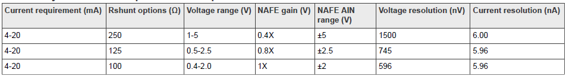](Current_Resistance_Table.PNG)

- Conversion method followed: Single channel single reading conversion.
- Connected voltage of +3 V using a power supply and also a resistance of 220 ohms in series with it to measure current across AI4P-AI4N which came out to be 0.014 A which can be seen on power supply output.

    

- Output current as calculated via SensedVoltage/Resistance is shown below:

    [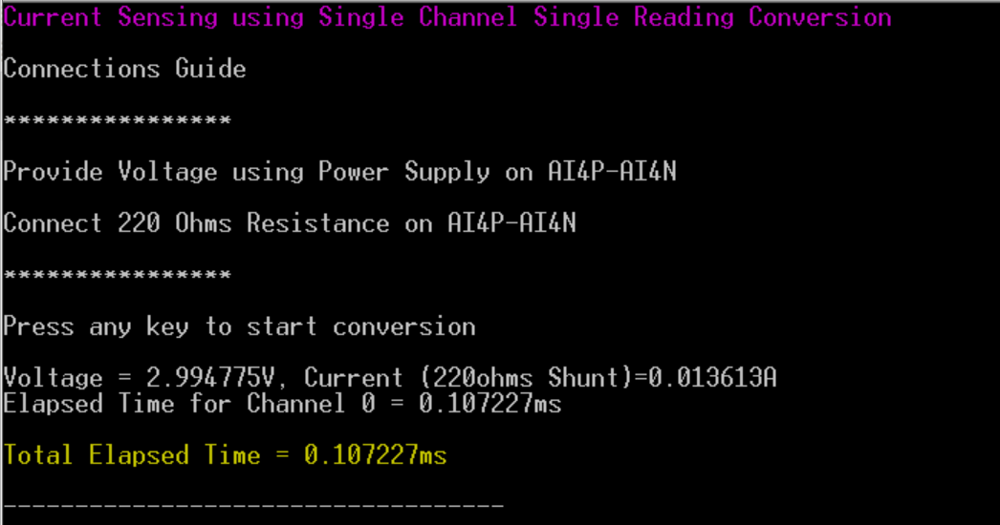](CurrentSensing_SCSR.PNG)

#### 3.4 2-wire RTD SCCR 

- Reading voltage across two wire RTD powered by NAFE13388 VIEX using single channel continuous reading conversion.
- RTD stands for resistance temperature detectors.
- 
 A 2-wire RTD measures temperature by passing a current through a resistor that changes resistance with temperature. The voltage across the RTD is measured to calculate the resistance. In this setup, wire resistance can affect accuracy, making it best for short distances. 

- 
 The main drawback of a 2-wire RTD is reduced accuracy due to added resistance from the wires, affecting measurements. 

- 
 For more information about RTDs refer to this application note which covers all the theoretical and conceptual details about 2/3/4-wire RTDs: 

    [AN14127](https://www.nxp.com/docs/en/application-note/AN14127.pdf) RTD measurement system with NAFE13388/73388 family of devices.

- Connections guide for two-wire RTD:
    
    [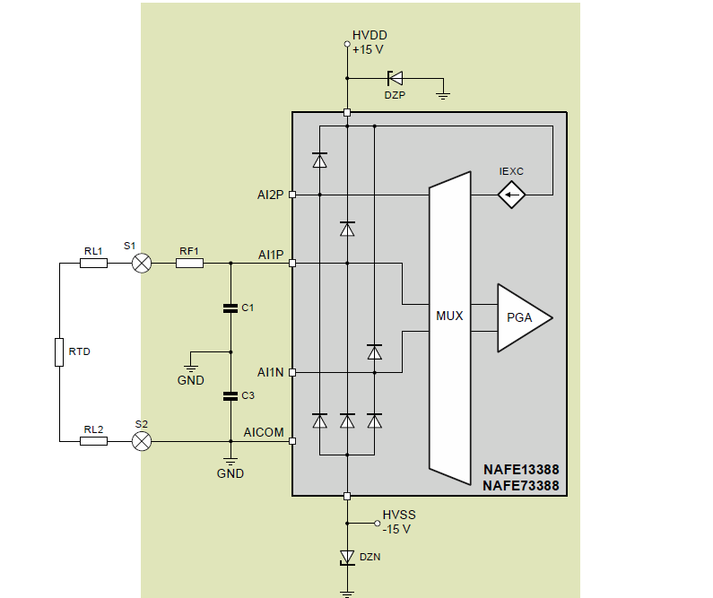](two_wire_RTD_shared_Exc_Source.PNG)
    
    
- Provide 750uA current using NAFE13388 VIEX to AI1P.
- Connect AI1P-AICOM as follows:
    - Red wire of 2-wire RTD to AI1P which is used to force the current of 750uA and sense the voltage as well.
    - White wire of 2-wire RTD to AICOM as a current return path.
- 
 Measure current across AI1P-AICOM by connecting any wire or resistance on AI1P, Place red probe of multimeter on AI1P on which wire/resistance is connected and black probe to AICOM which is J91 on NAFE13388. 

- In this case, current came out to be 765.5 uA as shown in figure below, replace Isource with the actual value measured for accurate readings.

    [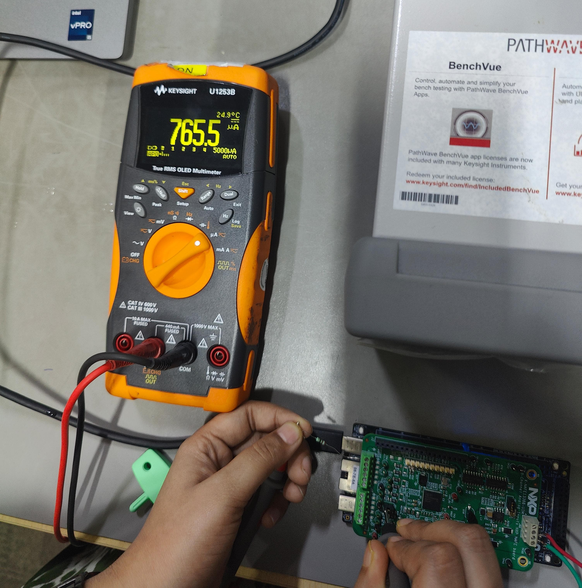](Isource.jpg)

    
- We can use 4 wire RTD to calulate temperature for 2 wire RTD as well, connect any red wire to AI1P and any white wire to AICOM as shown below:

    - Readings at room temperature:

        

        

    - Readings when dipped in cold water:

        

        [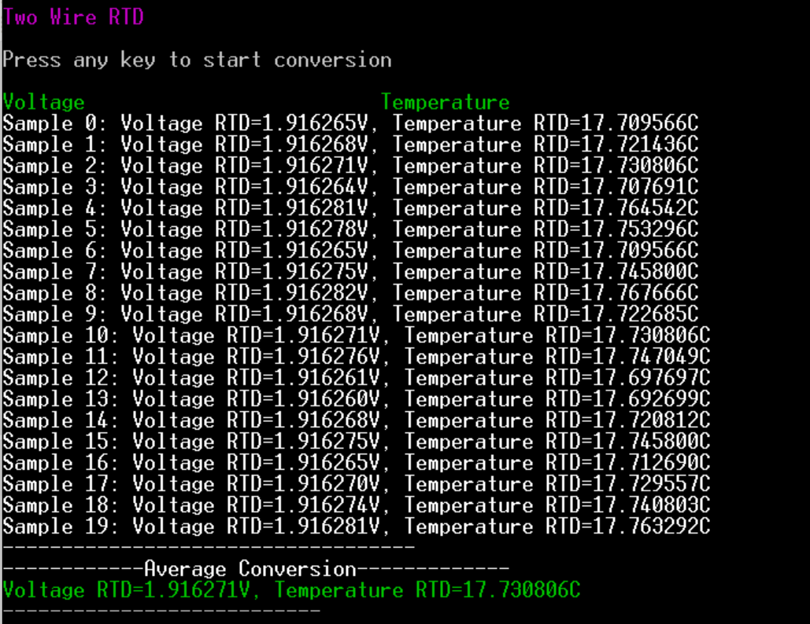](two_wire_rtd_with_water.PNG)

- **Note:** A 3-wire RTD is better than a 2-wire RTD because it compensates for the resistance of the connecting wires, improving measurement accuracy by canceling out the effects of lead wire resistance, especially in longer distances.

- **Note**: Since the NAFE13388 silicon doesn't provide the support to excite two analog inputs pins from single excitation pin as needed so we will not show the use case of three wire RTDs and directly proceed with four wire RTDs.
#### 3.5 4-wire RTD SCCR 

- Reading voltage across four wire RTD powered by NAFE13388 VIEX using single channel continuous reading conversion.

- 
 Four-wire RTDs are the most accurate because they completely eliminate the effects of lead wire resistance. In this setup, two wires supply current while the other two measure the voltage across the RTD, with no current flowing through the measurement wires. This setup provides highly precise temperature readings, ideal for critical applications. 

 

- 
 Force 750 uA current on AI2P-AICOM which becomes the force path to make 4-wire RTD work and sense the voltage after ADC conversion across AI1P-AI1N using differential sensing mechanism. 

- 
 For more information about RTDs refer to this application note which covers all the theoretical and conceptual details about 2/3/4-wire RTDs: 

    
    [AN14127](https://www.nxp.com/docs/en/application-note/AN14127.pdf) RTD measurement system with NAFE13388/73388 family of devices.

- Connections guide for four wire RTD:

    

- Provide 750 uA current using NAFE13388 VIEX to AI2P-AICOM.
- Connect one red wire of RTD to AI2P and one white wire to AICOM which completes the current forcing path required to force 750 uA current to RTD.
- Connect other red wire of RTD to AI1P and other white wire to AI1N which is the differential voltage sensing path which is then used to calculate temperature according to the conversion formulae.
- 
 Measure current across AI2P-AICOM by connecting any wire or resistance on AI1P, Place red probe of multimeter on AI2P on which wire/resistance is connected and black probe to AICOM which is J91 on NAFE13388. 

- In this case, current came out to be 765.5 uA as shown in figure below, replace Isource with the actual value measured to get for accurate readings.

    

    [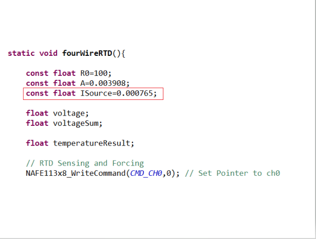](Isource_4wire_rtd_code.PNG)
- Connections and Results are as follows:

    - Readings at room temperature:

        

        

    - Readings when dipped in cold water:

         

         [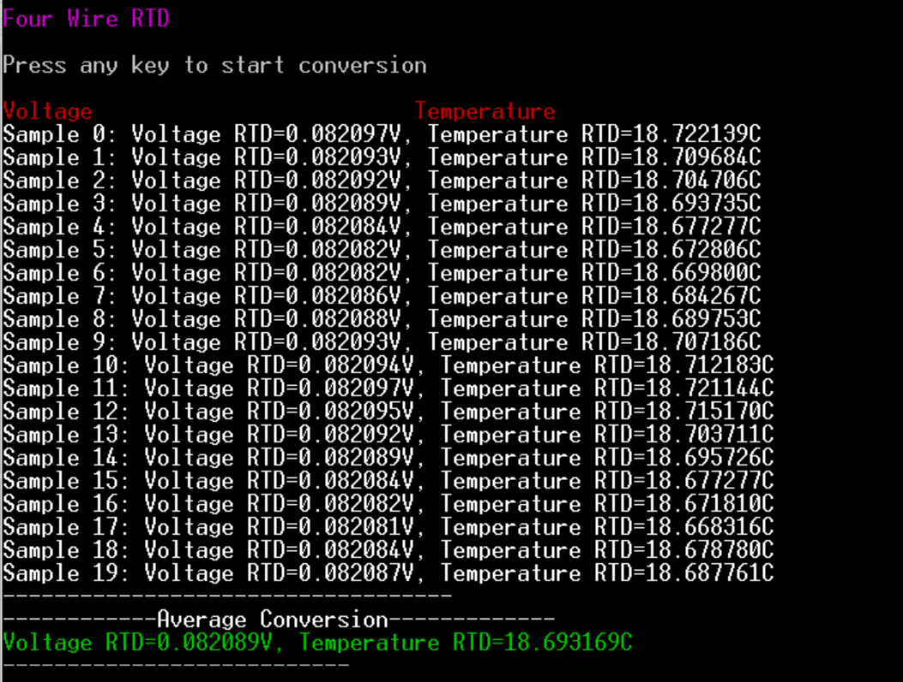](Four_wire_rtd_with_water.PNG)
        
- **Note:** A 4-wire RTD is better because it eliminates the influence of lead wire resistance, providing more accurate temperature measurements. The difference of around 3°C between 2-wire and 4-wire RTDs arises because the 2-wire setup includes lead resistance in the measurement, causing higher temperature errors.
    
#### 3.6 Weight scale SCCR 

- 
  <b> Weight Cell (Load Cell): </b> Calibration and reading procedure of a load cell, the load cell excitation is generated by the NAFE integrated VIEX, the conversion is performed using single channel continuous readings conversion 

- 
A load cell is a transductor used to translate mechanical force, such as weight, into measurable quantity. Load cells are usually composed of a strain gauge positioned on an elastic element. The elastic element is usually made of steel, so it is strong, but also has some elasticity. The minute variations on the spring element can be detected with strain gauges. The strain of the strain gauge is then converted by the electronics (ADC + excitation circuit) to determine the weight. 

- 
 In a load cell, a wheatstone bridge structure is used to transform a resistance value to a voltage value. The wheatstone architecture utilizes a strain gauge in place of resistors. AI2P of the NAFE is used as output voltage, while AI1P and AI1N are used to sense the voltage across the bridge. 

     [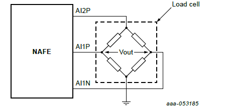](loadCell_wheatstoneBridge.PNG)

- 
 This application needs a voltage excitation source and two input channels to sense the voltage. Use a slow data rate and a higher gain configuration to improve the quality of reading as the sense voltage range will be in the order of mV. 

- Connections guide for weighing scale:

    - 
 Connect red and black wires of the load cell to AI2P and AICOM respectively for forcing 6 volts excitation voltage to AI2P. 

    - 
 Connect AI1P-AI1N with green and white wires respectively to sense differential voltage acrross which is required for weight calculation. 

- 
 Need of 6 V excitation voltage: A 6 V excitation voltage is required for a load cell to provide a stable and consistent voltage to the strain gauges. This excitation voltage powers the strain gauges and ensures that any changes in their resistance due to applied force result in measurable voltage changes. Higher excitation voltage, like 6 V, improves the signal-to-noise ratio, enhancing the accuracy and resolution of the weight measurement. It also ensures the strain gauges operate within their optimal range for precise and reliable performance. 

- Three step process to calibrate and measure weight of any object:
   
    1. Offset calculation:Firstly, sense the voltage across load cell without putting any weight, resulting voltage should be stored as offset.
    2. Calibration coefficient calculation: Calibrate the load cell with known weight and store the value of calibration coefficient as follows:

        - calibrationCoeff = (knownWeight)/(ConversionResult-Offset)
    3. Now any weight can be measured, by voltage conversion read by the ADC (Vadc):
        
        - Weight = calibrationCoeff * (Vadc - Offset)

- Step 1: Offset calculation(without any weight):

    [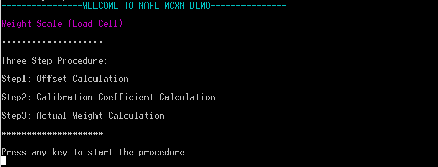](WeightScale_1.PNG)

    [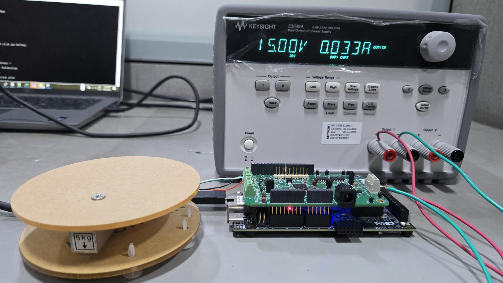](loadCellWithoutWeight.jpg)

- Step 2: Calculation of calibration coefficient by calibrating the weight scale with known weight (303g in this case):

    [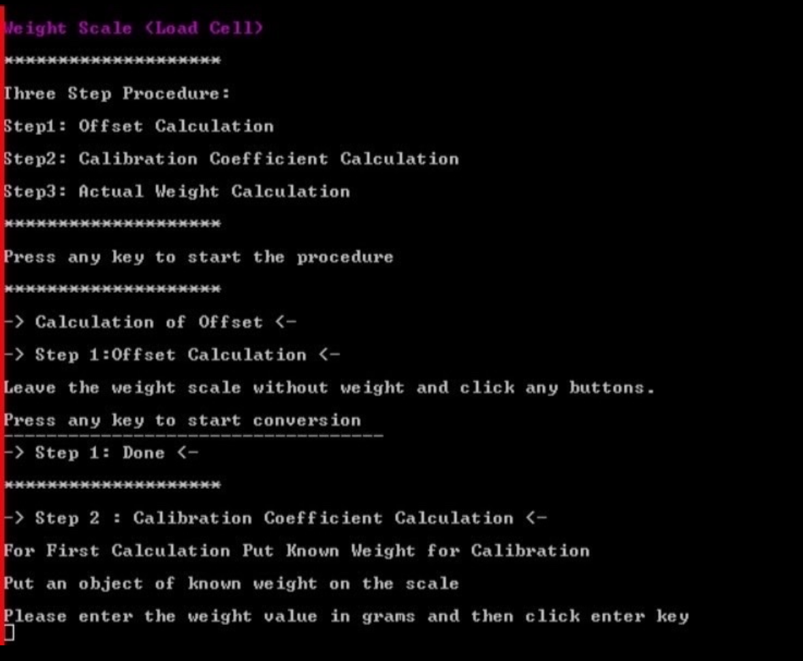](WeightScale_2.PNG)

    [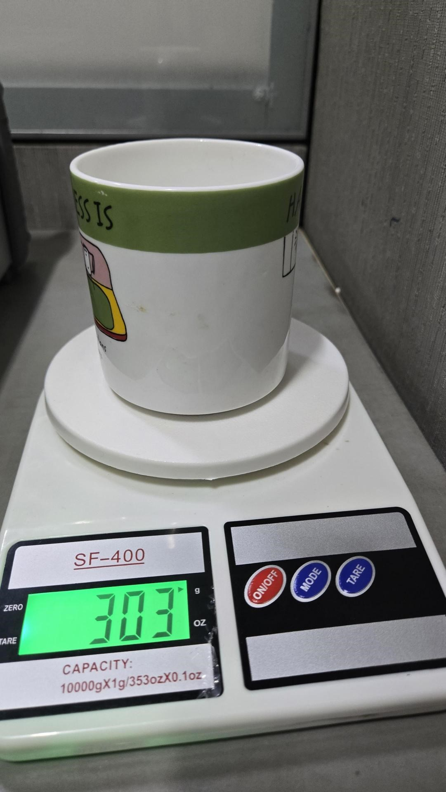](mugWeightScale_actualWeight.jpg)

    

- Step 3: Actual weights calculation (289g in this case):

    [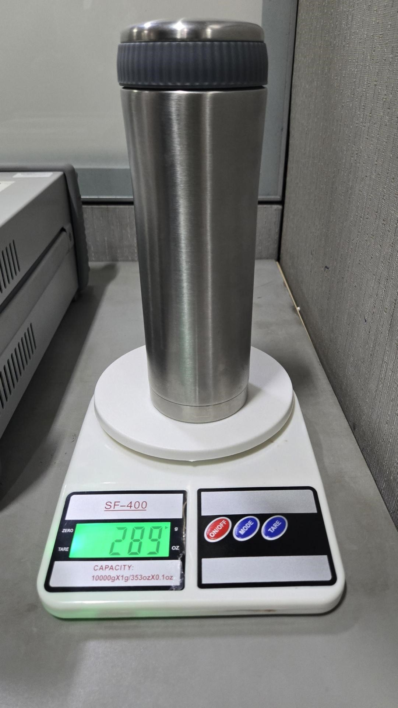]( bottleWeightScale_actualWeight.jpg)

    [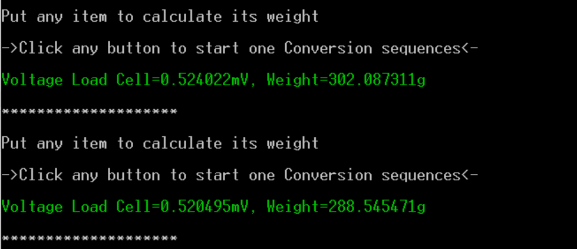](WeightScale_3.PNG)
