# NXP Application Code Hub

##  GUI for running different applications of NAFE13388-UIM on FRDM-MCXN947

This document provides information about running different applications of analog front end on graphical user interface: 

- Voltage sensing (SCSR, MCMR, MCCR, SCCR and so on)
- Current sensing
- 2-wire RTD
- 4-wire RTD
- On Board RTD
- Weight scale (load cell)

## Table of Contents
1. [Software](#software)
2. [Setup](#setup)
3. [Key features of GUI](#key-features-of-gui)
4. [Applications overview and test results](#applications-overview-and-test-results) 
   4.1 [Internal signals testing](#internal-signals-testing)  
   4.2 [Voltage sensing using different reading modes](#voltage-sensing) 
   4.3 [Current sensing](#current-sensing-) 
   4.4 [2-wire RTD](#2-wire-rtd) 
   4.5 [4-wire RTD](#4-wire-rtd) 
   4.6 [On Board RTD](#on-board-rtd) 
   4.7 [Weight scale](#weight-scale) 

## 1. Software
- [IoT Sensing SDK (ISSDK) v1.8](https://nxp.com/iot-sensing-sdk) offered as middleware in MCUXpresso SDK for supported platforms
- [MCUXpresso IDE v11.9.0](https://www.nxp.com/design/design-center/software/development-software/mcuxpresso-software-and-tools-/mcuxpresso-integrated-development-environment-ide:MCUXpresso-IDE)

## 2. Setup
### 2.1 Step 1: Download and Install required Software(s)

- Install MCUXpresso IDE 11.9.0
- Download and install [MCUXpresso SDK v2.14.0 for FRDM-MCXN947](https://mcuxpresso.nxp.com/en/builder?hw=FRDM-MCXN947). Make sure to select ISSDK  middleware while building SDK.
- Install Git v2.39.0 (for cloning and running west commands).
 
### 2.2 Step 2: Clone the APP-CODE-HUB/dm-nafe13388-application-examples
- Clone this repository to get the firmware to be flashed on FRDM-MCXN947:
- Change the directory to the cloned project folder: 
    cd *dm-nafe13388-application-examples*
 
**Note:** If using windows to clone the project,configure the filename length limit using below command:
**git config --system core.longpaths true**

### 2.3 Step 3: Firmware flashing on FRDM-MCXN947
- **For flashing firmware code, connect a type-C cable to J17 of the FRDM-MCXN947, which is MCU-debug link port.** 
- Firmware code location: **examples_GUI/firmware** 
- Open MCUXpresso IDE and select a directory to create workspace.
- Install MCXUpresso SDK 2.14.x for FRDM-MCX947 (drag and drop SDK zip into "Installed SDK" view) into MCUXpresso IDE.
- Go to "Quickstart Panel" and click on "Import Project(s) from file system".
- Select "Project directory (unpacked)" and browse to the cloned project folder (firmware).
- Right click on the project and select build to start building the project.
- Click on debug to flash the firmware on FRDM-MCXN947.

### 2.4 Step 4. Setup for GUI
- Download and install **NAFE13388_UIM GUI Setup.msi** from this location: **examples_GUI/host_setup/Release**.
- **To run the GUI, connect a type-C cable to J11 of the FRDM-MCXN947, which is a USB port.**

## 3. Key features of GUI

- **Main configuration:** This tab displays the block diagram of the NAFE13388 and have drop down boxes to select all the configurations required according to the application.
        
- **Read/Write method:** User can read/write register fields by right clicking on any particular drop down box in the GUI.

     [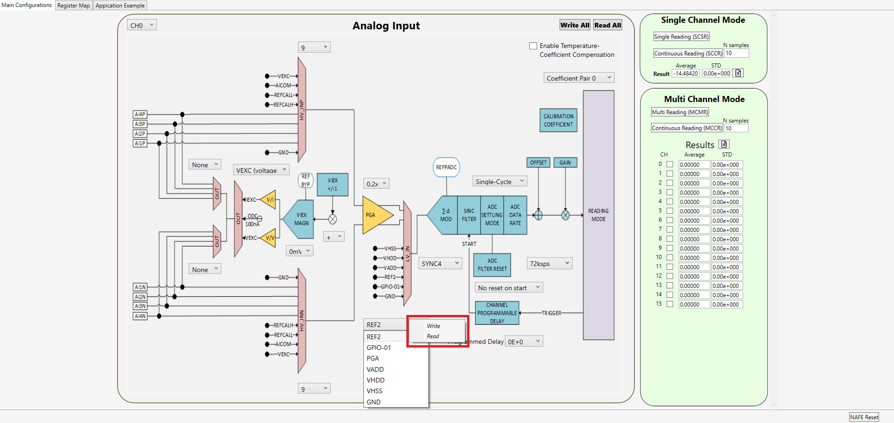](Kye-Feature.png)
 
- **Channel configuration menu:** At the right side of the main configuration tab, this menu is used to perform conversion/reading operations like SCSR, MCMR, SCCR, MCCR.
- **GPIOs Configuration:** 
    - This tab is used to manage some settings of the ADC system and operate the 10 GPIOs present on the NAFE13388-UIM shield board.
    - The settings that are possible to change are (refer to the image below):
        1) ADC Data BIT, 24 bits. 
        2) Reference selection for REF_BYP.
        3) Reference selection for REFPADC.
        4) Clock selection: Internal, External, or Crystal.
        5) Data ready signal behavior: Asserted on every channel in sequence or Asserted on end of sequence.
  
     [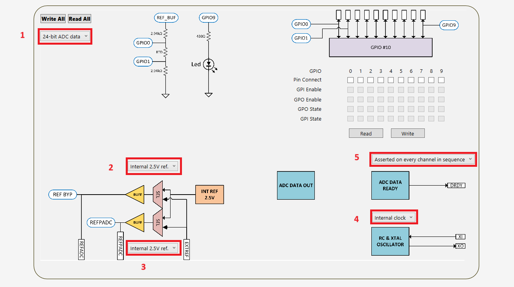](Gpio_Config.png)

    - The NAFE13388 has ten GPIOs, manageable from the GUI, in Output and Input modes as seen in the below image.
  
     [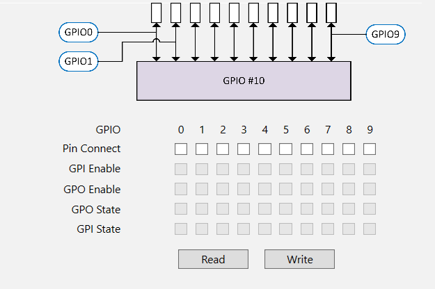](Kye-Feature.png)

    - The bits that can be accessed from this matrix are:
        - Pin Connect: Should be enabled to use the connected pins as GPIOs.
        - GPI/GPO Enable: Depending on the desired functionality, GPI/GPO must be enabled.
        - GPO State: Enable or disable this cell to put 1 or 0 on the selected GPIOs. 
        - GPI State: Click the Read button to update the cell states of the GPIOs set as Input.
    - GPIO Testing:
        - Configure Gpio 2,4 and 7 as output and set the GPO state cell(tick means it is set to High) and click on "Write" button, then observe the led status change accordingly.
         
        [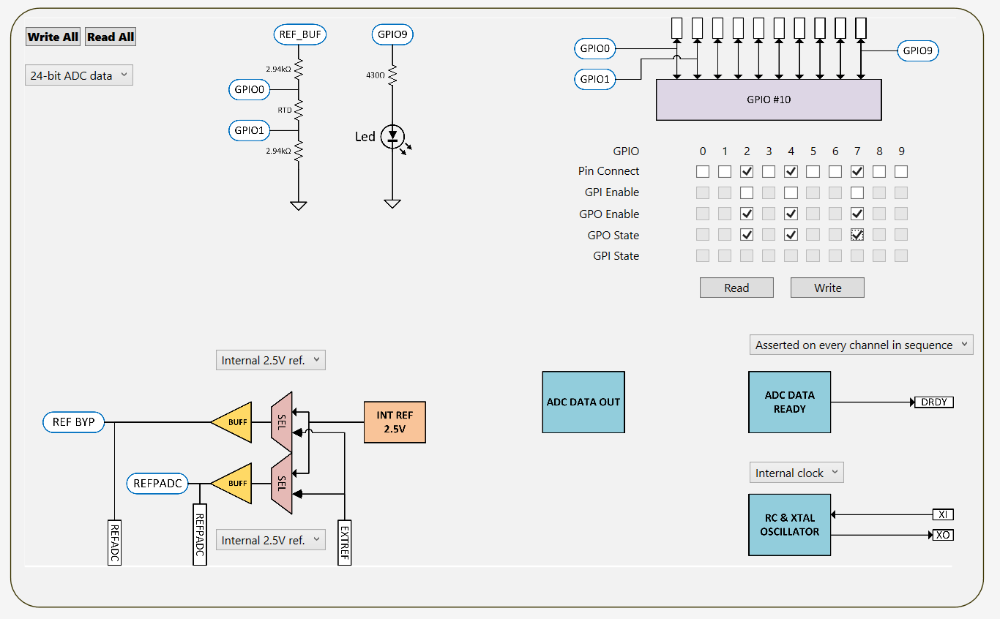](Gpio_test.png)

        - Result:

        [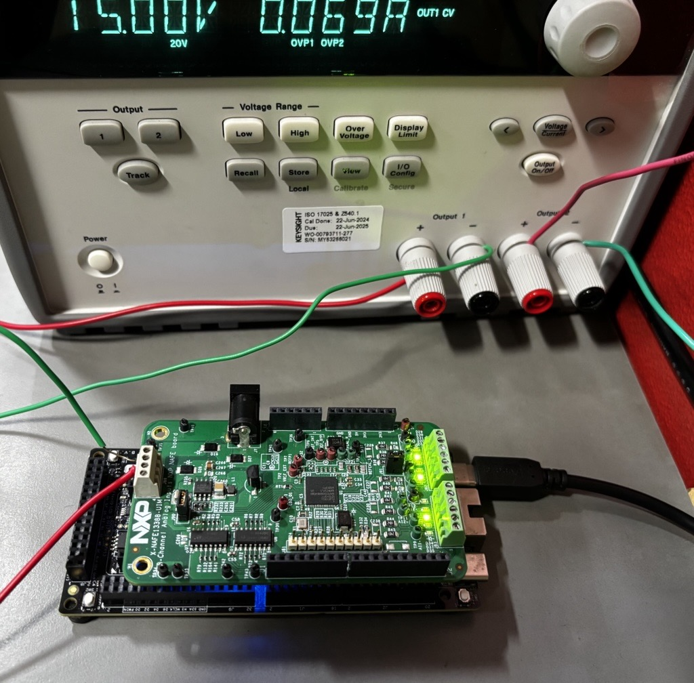](Gpio_HW.jpeg)
        
- **Calibration:** 
    - This tab is used to perform the calibration of the device and write the particular Gain/Offset registers.
     
     [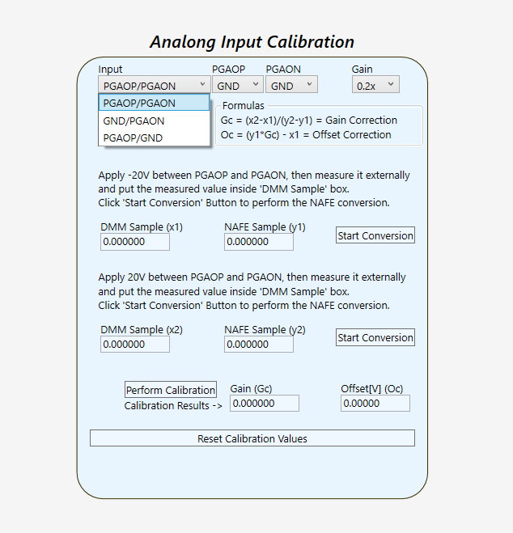](Cal_Tab.png)

    - **Steps to perform calibration**:
      - To perform calibration select the type of input required from the Input drop-down box as shown in the image above:
          - PGAOP/PGAON: Differential input.
          - PGAOP/GND: Single-ended input.
          - GND/PGAON: Single-ended input.
      - After selecting the input, choose the required pins from PGAOP and PGAON drop down box, and set the gain value. Then, select the appropriate Coefficient Pair to use.
      - Next, apply the required voltage to the specified pins as indicated in the text box. Measure the voltage with a multimeter and enter the value into the DMM Sample box. Click the "Start Conversion" button to obtain the NAFE Sample value.
      - After that, click the "Perform Calibration" button to begin the calibration process.
      - User can check the register mapping on CH15 in the register map, as well as the updated values for the coefficient pair (Gain and Offset registers) in the system register menu under the register map tab.
    - **For example**: 
      - After performing calibration for the **Differential Input** case using the pins AI1P and AI2N with a gain of 0.8x and Coefficient Pair 0:
      - Apply -5V between AI1P and AI2N, measure the voltage with a multimeter as seen in the image below, and enter the value into the DMM Sample(x1) box.
        
        [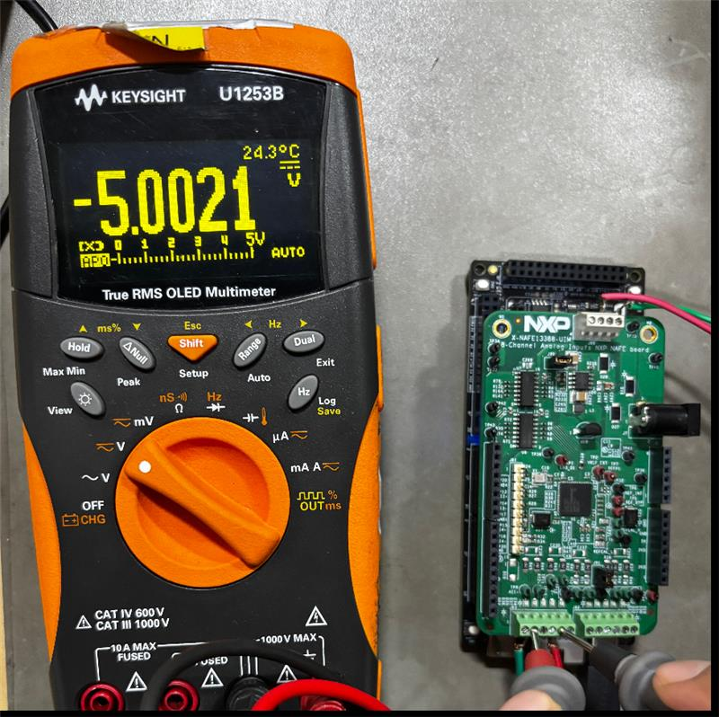](Cal_N.jpg)

      - Then, click "Start Conversion" to obtain the NAFE Sample value(y1).
      - Next, apply +5V between AI1P and AI2N, measure the voltage with a multimeter as seen in the image below, and enter the value into the DMM Sample(x2) box .
            
        [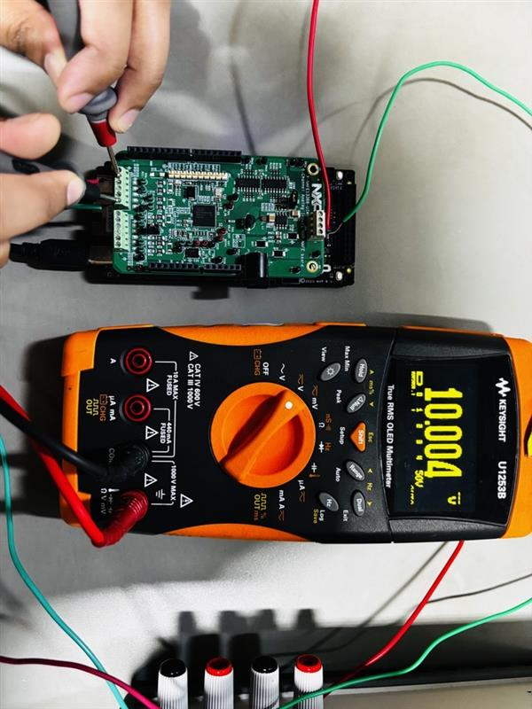](Cal_P.jpeg)

      - Click "Start Conversion" to obtain the NAFE Sample(y2), and then click on "Perform Calibration" to save the selected Coefficient Pair.
            
        [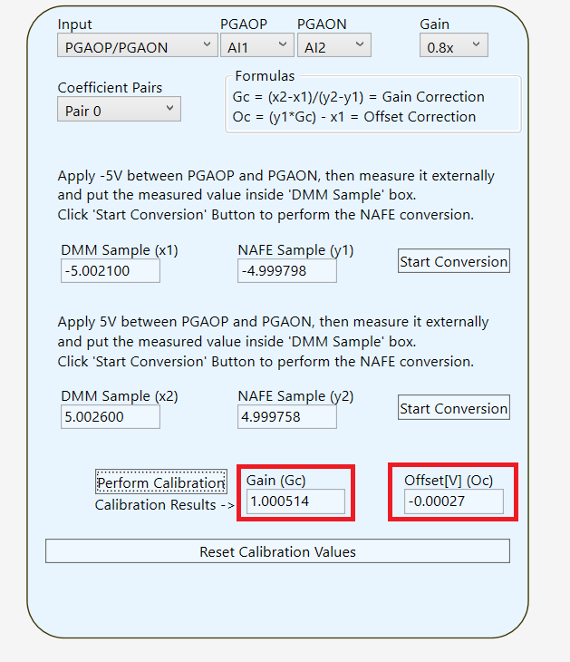](Cal_Tested.png)
         
      - The updated Gain and Offset values as per the calibration in the image above.

- **Register map:** This tab is used to read and write all of the registers.
- **Applications:** This tab is used to test different applications of the AFE, such as current sensing, 2/4-wire resistance temperature detector (RTD), weight scale, and so on.
- **Import/Export:** This feature in the register map tab is used to read and write all of the registers. It uses json to import and export different configuration registers for all channels and other system registers.

    - 
Export feature: To export the register map settings done for the specific applications.

         [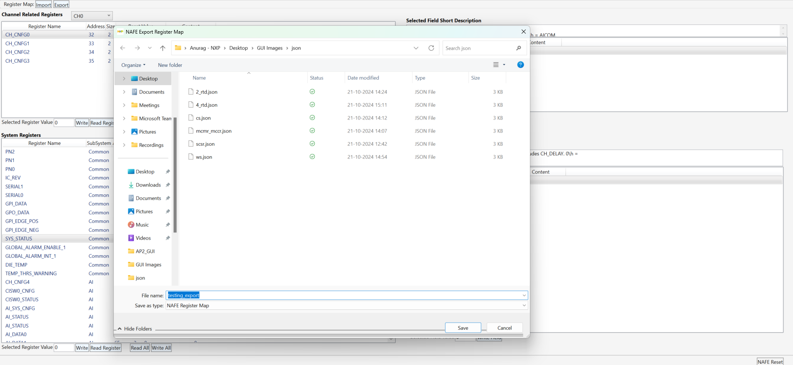](export_Test.png)

    - 
Import feature: To import the register map settings exported to save the time required in manual register configuration. 

         [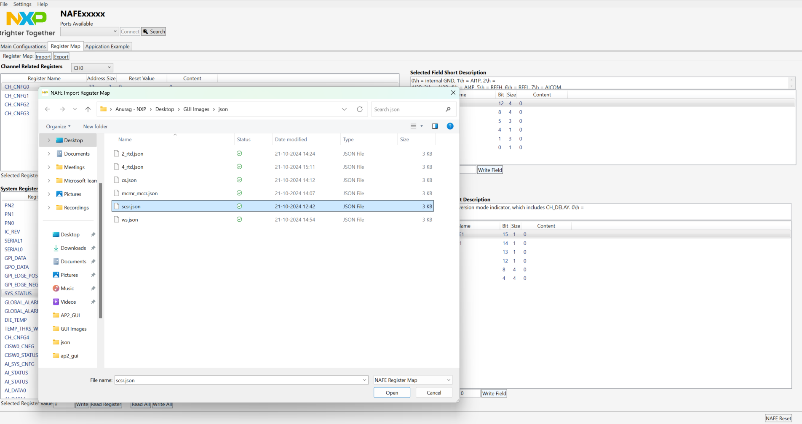](import_test.png)

    - **Note**: For testing all the applications, json files that have register configurations are provided. The user can import json file corresponding to the application being test. 

        - json files location: **examples_GUI/import_export_test_json**

## 4. Applications overview and test results

<h3><b> NAFE13388-UIM applications </b></h3> 

**Note:** Before starting any application, press the **read all** button at the bottom of the system registers in Register Map tab, after making the necessary hardware connections to read all the system registers at once.

[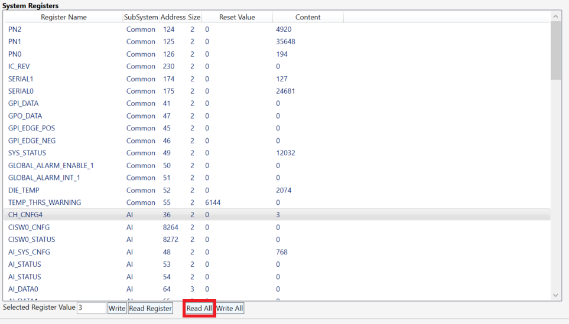](system_reg_readall.png)

#### 4.1 Internal signals testing 

- This table showcases the settings to use the LVMUX signals.
  
  [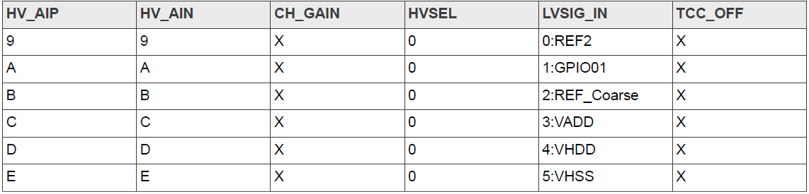](Signals.png)

- User can test the internal signals of NAFE13388 like VADD, VHDD, VHSS etc.
    
    - Expected values for internal signals:
        
        - REF2 - 3 V
        - GPIO-01 - 0.04 V
        - VADD - 3.3 V
        - VHDD - +15 V
        - VHSS - -15 V

    [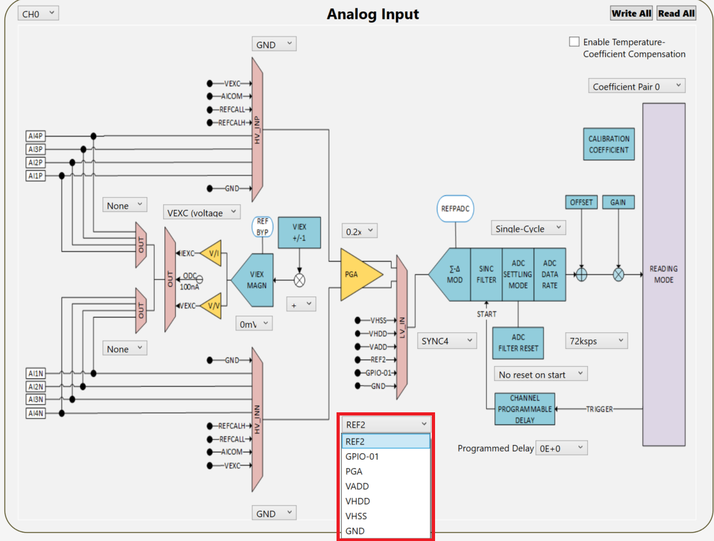](Internal_Sig.png)

- Steps to test internal signals:

    - Select the internal signal under test and then right click on the drop down box to configure the registers
    - Click on "Single Reading (SCSR)" button in the "Single Channel Mode" menu in the main configurations tab to see the result.

        - REF2 

            [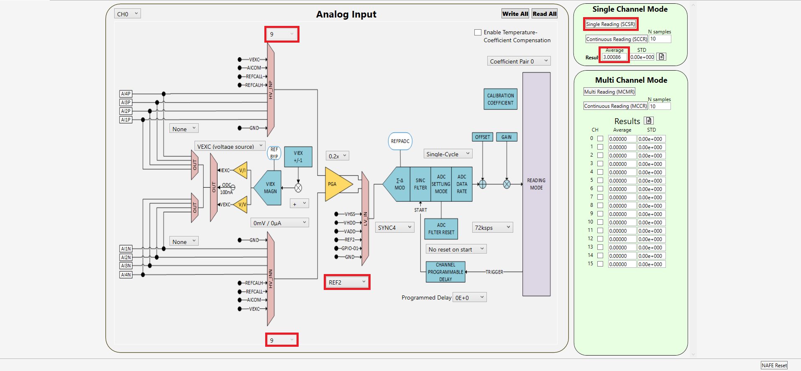](REF2.png)
        
        - GPIO-01   
            
            [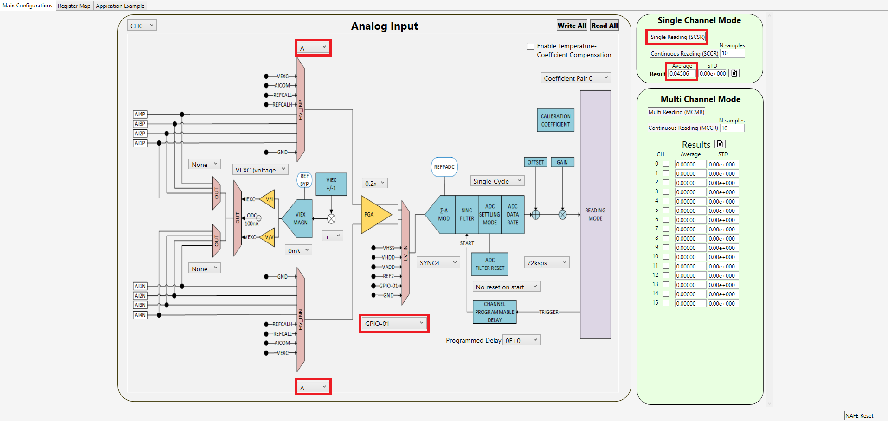](GPIO-01.png)

        - VADD

            [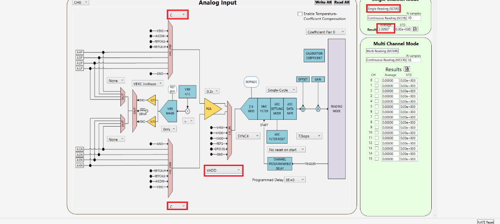](VADD.png)

        - VHDD

            [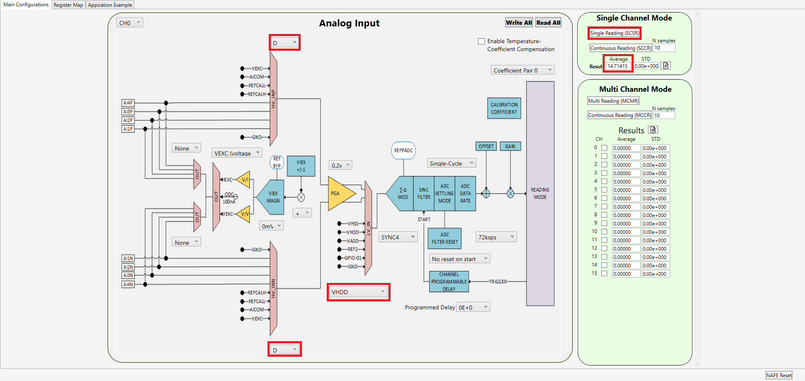](VHDD.png)

        - VHSS

            [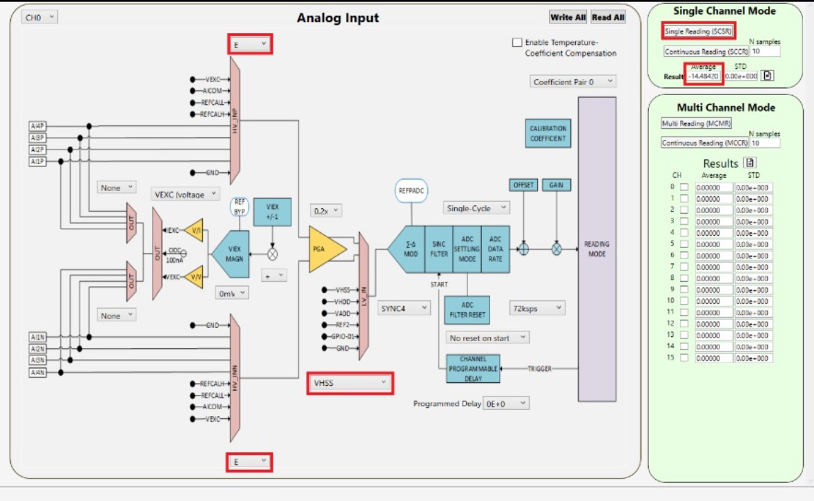](VHSS.jpg)

#### 4.2 Voltage sensing using different reading modes 

- 
Voltage sensing is performed for single-ended as well as differential signals using single channel single reading conversion. 

- 
 Test scenario: A single ended (AIxP/AIxN-AICOM) or differential (AIxP-AIxN) voltage is applied using power supply on analog inputs.The inputs sense these voltage levels and provide results after analog-to-digital conversion. 

**Note:** Apply voltage on analog inputs keeping in mind the HV input ranges supported by NAFE13388 IC by referring electrical characterestics chapter from NAFE13388 datasheet.

- Connect the power supply to the analog inputs according to the application requirements.
    
- Apply voltages in range according to the following table:

     

- Single-ended voltage sensing:
    
    - Connected AI1P-AICOM and AI2P-AICOM.

    - Applied 5 V on AI1P-AICOM and 2.03 V on AI2P-AICOM using a power supply.
    
        

    **Conversion methods followed:**

    - **Single channel single reading conversion (SCSR)** on AI2P-AICOM with 2.03 V.

        - Perform all the register configurations and then press "Single Reading (SCSR)" button.

        - Follow either manual register configuration or configuration using json for register configuration.
    
        - Manual register configuration:
           - Channel configuration registers (bit fields) to be set by the following:

                - CH_CONFIG0: 
                    - HV_AIP: 2
                    - HV_AIN: 0
                    - CH_GAIN: 0
                    - HV_SEL: 1
                    - LVSIG_IN: 2

                - CH_CONFIG1:

                    - ADC_DATA_RATE: 5
                    - ADC_SINC: 0
            - Result after SCSR conversion:

                [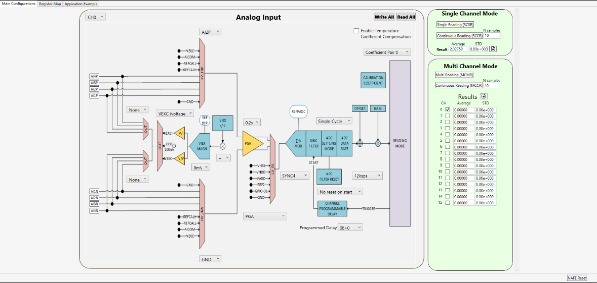](SCSR_PGA.png)

        - Register configuration using json:
            - Use [scsr.json](./import_export_test_json/scsr.json) to import register and channel settings for SCSR conversion, then press the **Write All** button of both the channel registers and system registers to write all the registers at once.
 
    - **Single channel continuous reading (SCCR)** on AI2P-AICOM with 2.03 V.        

        - Follow either manual register configuration or configuration using json for register configuration. 

        - Manual register configuration:
            - Channel configuration registers (bit fields) to be set by the following:

                - CH_CONFIG0: 
                    - HV_AIP: 2
                    - HV_AIN: 0
                    - CH_GAIN: 0
                    - HV_SEL: 1
                    - LVSIG_IN: 2

                - CH_CONFIG1:

                    - ADC_DATA_RATE: 5
                    - ADC_SINC: 0

            - Input the number of samples in the N samples button between 0-100, inside the **Single Channel Mode** menu or use the default number of samples (10), and press **SCCR** to start the conversion.

            - Result after SCCR conversion:

                [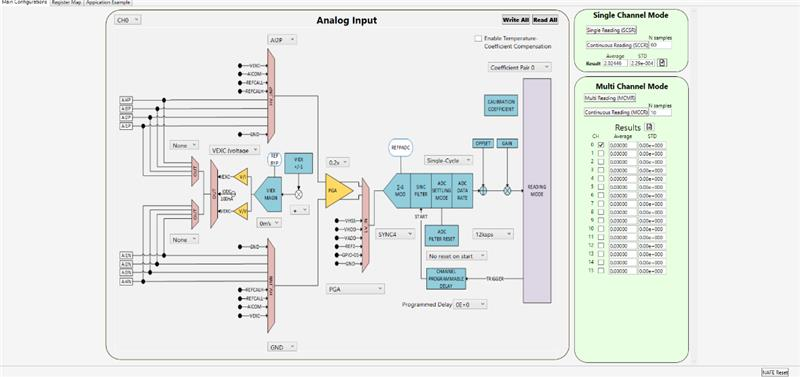](SCCR_PGA.png)

        - Register configuration using json:

            - Use [scsr.json](./import_export_test_json/scsr.json) to import register and channel settings for SCCR conversion and then press **Write All** of both the channel registers and system registers to write all the registers at once.

    - **Multi channel multi reading (MCMR)** on AI1P-AICOM and AI2P-AICOM with 5 V and 2.03 V respectively.

        - Perform all the register configurations and then press "Multi Reading (MCMR)" button. 

        - Set the CH_CONFIG4 in system registers menu in the register map tab to enable channel 0 and channel 1 for conversion:
            - CH_CONFIG4:

                - MCH_EN0: 1
                - MCH_EN1: 1

        - Channel 0 is configured for AI1P-AICOM with 5 V.

        - Follow either manual register configuration or configuration using json for register configuration. 

        - Manual register configuration:

        - Channel configuration registers (bit fields) to be set as given below:

            - CH_CONFIG0: 
                - HV_AIP: 1
                - HV_AIN: 0
                - CH_GAIN: 0
                - HV_SEL: 1
                - LVSIG_IN: 2

            - CH_CONFIG1:

                - ADC_DATA_RATE: 5
                - ADC_SINC: 0

            - CH_CONFIG2:

                - CH_DELAY: 11 
        - Result after MCMR conversion for channel 0:

            [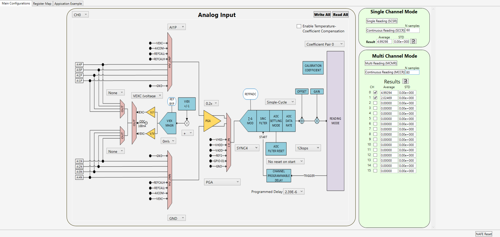](MCMR_PGA.png)

        - Channel 1 is configured for AI2P-AICOM with 2.03 V.
    
        - Manual register configuration:

            - Channel configuration registers (bit fields) to be set as given below:

                - CH_CONFIG0: 
                    - HV_AIP: 2
                    - HV_AIN: 0
                    - CH_GAIN: 0
                    - HV_SEL: 1
                    - LVSIG_IN: 2

                - CH_CONFIG1:

                    - ADC_DATA_RATE: 5
                    - ADC_SINC: 0

                - CH_CONFIG2:
                
                    - CH_DELAY: 11 
            - Result after MCMR conversion for channel 1:

                [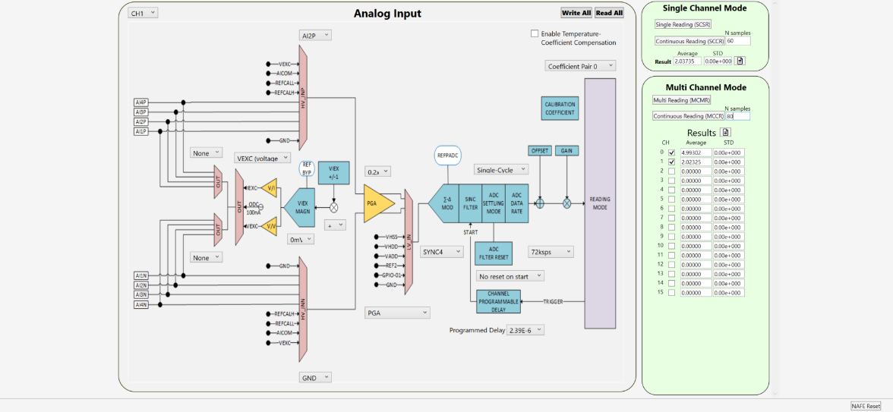](MCMR_CH1_PGA.png)

        - Register configuration using json:    
            - Use [mcmr_mccr.json](./import_export_test_json/mcmr_mccr.json) to import the register and channel settings for MCMR conversion and then press **Write All** button of both the channel registers and system registers to write all the registers at once.

    - **Multi channel continuous reading (MCCR)** on AI1P-AICOM and AI2P-AICOM with 5 V and 2.03 V respectively.
 

        - Register field configurations are exactly same as done in MCMR scenario above.

        - Input the number of samples in the N samples button between 0-100, inside the **Multi Channel Mode** menu or use the default number of samples (10), and press **MCCR** to start the conversion.

        - Results after MCCR conversion for channel 0:

         [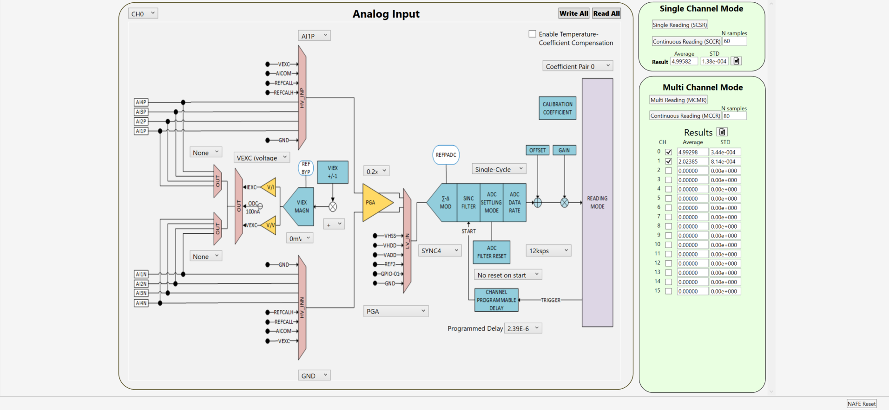](MCCR_PGA.png)

        - Results after MCCR conversion for channel 1:

        [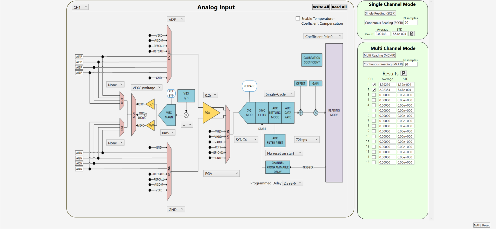](MCCR_CH1_PGA.png)

- Differential voltage sensing:
    - Connected AI4P-AI4N as shown in diagram below.

    - Set HV_AIP to 4 and HV_AIN to 4 and rest all other configurations same as done for above voltage sensing conversion modes as discussed above.

    - The following conversion methods can be used as mentioned above for this case: SCSR, MCMR, MCCR and SCCR.

    - Apply 2.70 V on AI14P-AICOM and 2.53 V on AI4N-AICOM using a power supply.calculation is performed as follows: AI4P-AI4N = 2.70-2.53 which is equal to 0.17 V.

    - Hardware setup for differential sensing:

        
    - Result after conversion:

        [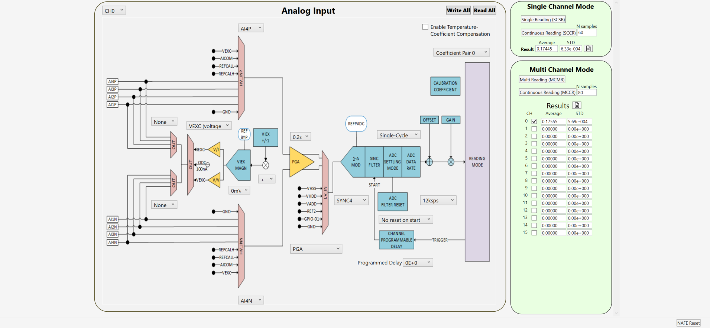](Differential_PGA.png)

#### 4.3 Current sensing 

- 
 Current sensing in the NAFE13388 works by using a small, precise resistor to measure how much current is flowing in a system. It converts the current into a voltage that the device can read. This method is accurate, reduces noise, and is commonly used for monitoring things like pressure in industrial systems. 

- 
 The NAFE13388 measures pressure using a pressure transmitter that converts pressure into a standard current signal, typically ranging from 4 mA to 20 mA. For example, 4 mA might represent 0 pressure, and 20 mA could represent maximum pressure (for example 10 bars). The device reads the current through a precise resistor, converts it to a voltage, and then calculates the corresponding pressure based on the current value. This allows the system to accurately track changes in pressure. 

- Provide voltage to analog input AI4P-AI4N using a power supply.
- Connect resistance in series with voltage on AI4P-AI4N to measure current across AI4P-AI4N.
- Refer this table to set voltage and corresponding gains based on resistances used:
     
    

- Conversion method followed: SCSR and SCCR.

- Follow either manual register configuration or configuration using json for register configuration. 

- Perform all the register configurations, then press **Start Single Conversion** button or press **Continuous Conversion** button to plot graph according to the continuous conversion sampled values.

- Manual register configuration:
    - Channel configuration registers (bit fields) to be set as given below:

        - CH_CONFIG0: 
            - HV_AIP: 4
            - HV_AIN: 4
            - CH_GAIN: 1
            - HV_SEL: 1
            - LVSIG_IN: 2

        - CH_CONFIG1:

            - CH_CAL_GAIN_OFFSET: 1
            - ADC_DATA_RATE: 5
            - ADC_SINC: 0

        - CH_CONFIG2:
        
            - CH_DELAY: 11 

- Register configuration using json:

    - Use [cs.json](./import_export_test_json/cs.json) to import register and channel settings for SCSR,SCCR conversion and then press the **Write All** of both the channel registers and system registers to write all the registers at once.

- Connected voltage of 3 V using a power supply and also a resistance of 218 ohms in series with it to measure current across AI4P-AI4N, which is 0.014 A, which can be seen on the power supply output.

    [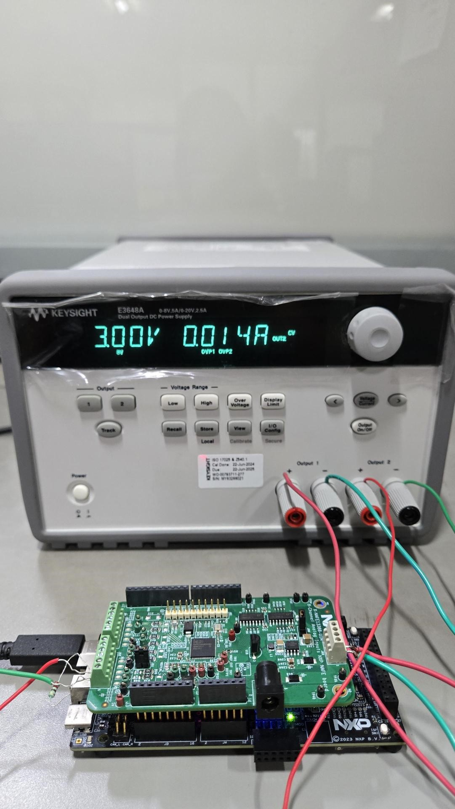](CurrentSensing.jpg)

- Output current as calculated via SensedVoltage/Resistance is shown below:

    [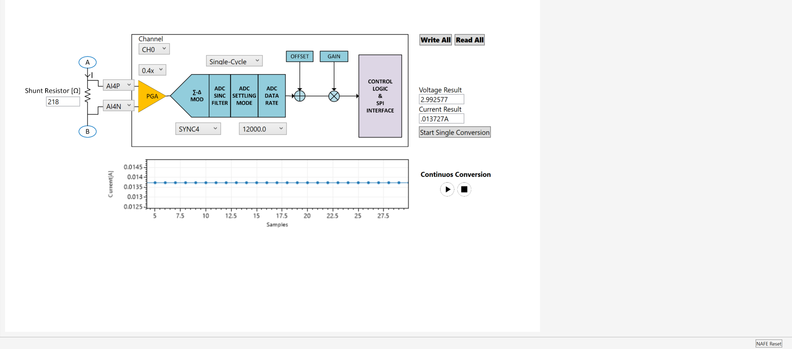](CS_1_Test.png)

- In the output shown above, the graph is plotted according to the number of samples captured in the SCCR conversion.

#### 4.4 2-wire RTD 

- Reading voltage across 2-wire RTD powered by NAFE13388 VIEX using SCCR.
- RTD stands for resistance temperature detectors.
- 
 A 2-wire RTD measures temperature by passing a current through a resistor that changes resistance with temperature. The voltage across the RTD is measured to calculate the resistance. In this setup, wire resistance can affect accuracy, making it best for short distances. 

- 
 The main drawback of a 2-wire RTD is reduced accuracy due to added resistance from the wires, affecting measurements. 

- 
 For more information about RTDs refer to this application note which covers all the theoretical and conceptual details about 2/3/4-wire RTDs: 

    [AN14127](https://www.nxp.com/docs/en/application-note/AN14127.pdf) RTD measurement system with NAFE13388/73388 family of devices.

- Connections guide for two-wire RTD:
    
    
	
    
- Provide 750 uA current using NAFE13388 VIEX to AI1P.

- Conversion method followed: SCCR conversion.

- Follow either manual register configuration or configuration using json for register configuration. 

- Perform all the register configurations, then press **Start Single Conversion** or press **Continuous Conversion** button to plot graph according to the continuous conversion sampled values.

- Manual register configuration:
    - Channel configuration registers (bit fields) to be set as given below:

        - CH_CONFIG0: 
            - HV_AIP: 1
            - HV_AIN: 0
            - CH_GAIN: 4
            - HV_SEL: 1
            - LVSIG_IN: 2

        - CH_CONFIG1:

            - CH_CAL_GAIN_OFFSET: 4
            - ADC_DATA_RATE: 16
            - ADC_SINC: 1

        - CH_CONFIG2:  
            - CH_DELAY: 11 
            - ADC_NORMAL_SETTLING: 1
        
        - CH_CONFIG3:
            - VIEX_VI: 1
            - VIEX_MAG: 12
            - VIEX_AIP_EN: 1
            - VIEX_AIN_EN: 0
- Register configuration using json:

    - Use [2_rtd.json](./import_export_test_json/2_rtd.json) to import register and channel settings for SCCR conversion and then press the write all button of both the channel registers and system registers to write all the registers at once.

- Connect AI1P-AICOM as follows:
    - Red wire of 2-wire RTD to AI1P which is used to force the current of 750uA and sense the voltage as well.
    - White wire of 2-wire RTD to AICOM as a current return path.
- 
 Measure current across AI1P-AICOM by connecting any wire or resistance on AI1P, Place red probe of the multimeter on AI1P on which wire/resistance is connected and black probe to AICOM which is J91 on NAFE13388. 

- In this case, the current came out to be 765.5 uA as shown in figure below, replace Isource with the actual value measured for accurate readings.

    

    [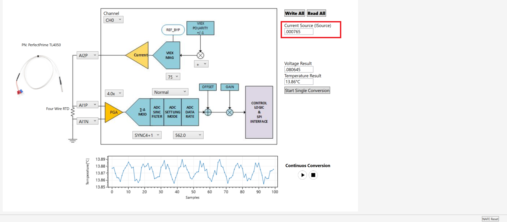](4_wire_rtd_Isource.png)
- 4-wire RTD can be used to calulate the temperature for 2 wire RTD as well, connect any red wire to AI1P and any white wire to AICOM as shown below:

    - Readings at room temperature:
        - Hardware setup:

        [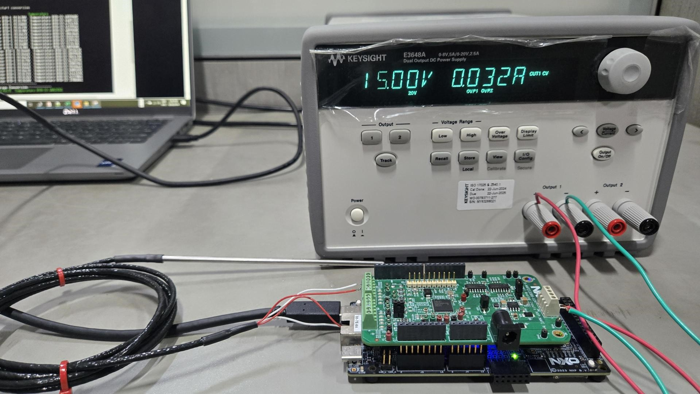](2wireRTD_withoutWater.jpg)

        - Result after conversion:

        [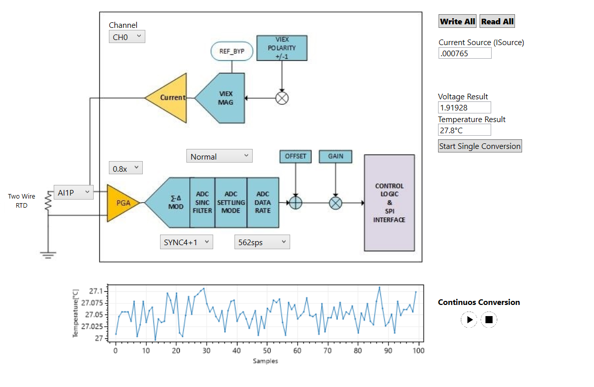](2_WRTD_normal_water_Test.png)

    - Readings when dipped in cold water:
        - Hardware setup:

        [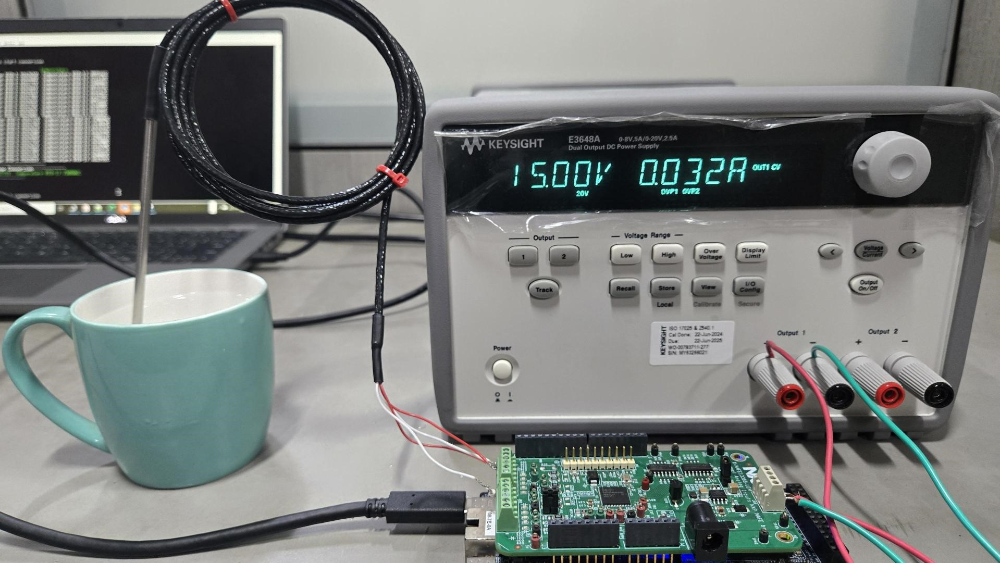](2wireRTD_withWater.jpg)

        - Result after conversion:

        [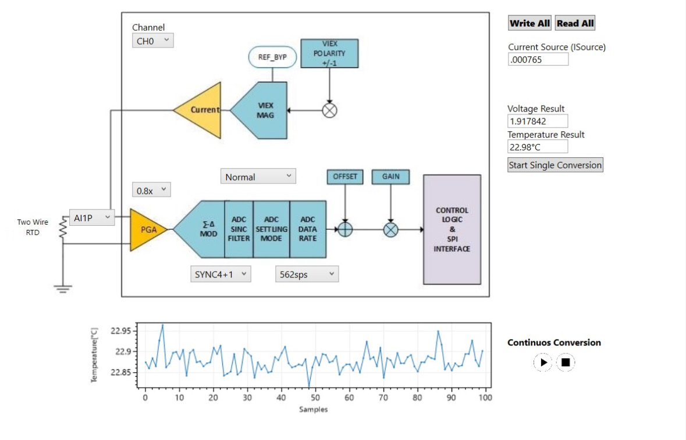](2_WRTD_cold_water.jpg)

- **Note**: Because the NAFE13388 silicon doesn't provide the support to excite two analog inputs pins from single excitation pin as needed so the use case of the 3-wire RTDs will not be shown, and the document will proceed to 4-wire RTD.

#### 4.5 4-wire RTD 

- Reading voltage across 4-wire RTD powered by NAFE13388 VIEX using single channel continuous reading conversion.

- 
 4-wire RTDs are the most accurate because they completely eliminate the effects of lead wire resistance. In this setup, two wires supply current while the other two measure the voltage across the RTD, with no current flowing through the measurement wires. This setup provides highly precise temperature readings, ideal for critical applications.

 
- 
 Force 750 uA current on AI2P-AICOM which becomes the force path to make 4-wire RTD work and sense the voltage after ADC conversion across AI1P-AI1N using differential sensing mechanism. 

- Connections guide for 4-wire RTD:

    [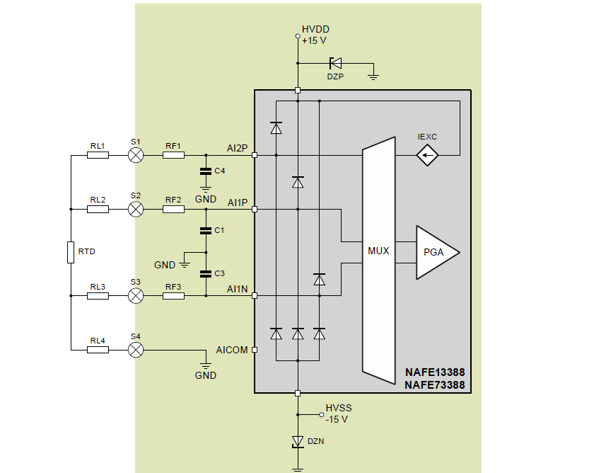](four_wire_rtd_connection_diag.PNG)

- Provide 750 uA current using NAFE13388 VIEX to AI2P-AICOM.

- Conversion method followed: SCCR conversion.

- Follow either manual register configuration or configuration using json for register configuration. 

- Perform all the register configurations and then press "Start Single Conversion" button
or press "Continuous Conversion" button to plot graph according to the continuous conversion sampled values.

- Manual register configuration:
    - Channel configuration registers (bit fields) to be set as given below:

        - CH_CONFIG0: 
            - HV_AIP: 1
            - HV_AIN: 1
            - CH_GAIN: 5
            - HV_SEL: 1
            - LVSIG_IN: 2

        - CH_CONFIG1:

            - CH_CAL_GAIN_OFFSET: 5
            - ADC_DATA_RATE: 16
            - ADC_SINC: 1

        - CH_CONFIG2:  
            - CH_DELAY: 11 
            - ADC_NORMAL_SETTLING: 1
        
        - CH_CONFIG3:
            - VIEX_VI: 1
            - VIEX_MAG: 12
            - VIEX_AIP_EN: 2
            - VIEX_AIN_EN: 0
- Register configuration using json:
    - Use [4_rtd.json](./import_export_test_json/4_rtd.json) to import register and channel settings for SCCR conversion and then press the Write All button of both the channel registers and system registers to write all the registers at once.

- Connect one red wire of the RTD to AI2P and one white wire to AICOM which completes the current forcing path required to force 750 uA current to RTD.
- Connect other red wire of the RTD to AI1P and other white wire to AI1N which is the differential voltage sensing path that is then used to calculate temperature according to the conversion formulae.
- 
 Measure current across AI2P-AICOM by connecting any wire or resistance on AI1P, Place red probe of multimeter on AI2P on which wire/resistance is connected and black probe to AICOM which is J91 on NAFE13388. 

- In this case, current comes out to 765.5 uA as shown in figure below, replace Isource with the actual value measured to get accurate readings.

    

    
- Connections and results are as follows:

    - Readings at room temperature:
        - Hardware setup:

        [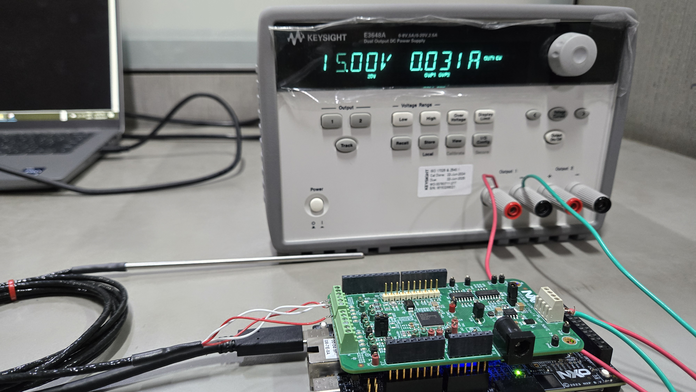](4wireRTD_wihoutWater.jpg)

        - Result after conversion:

        [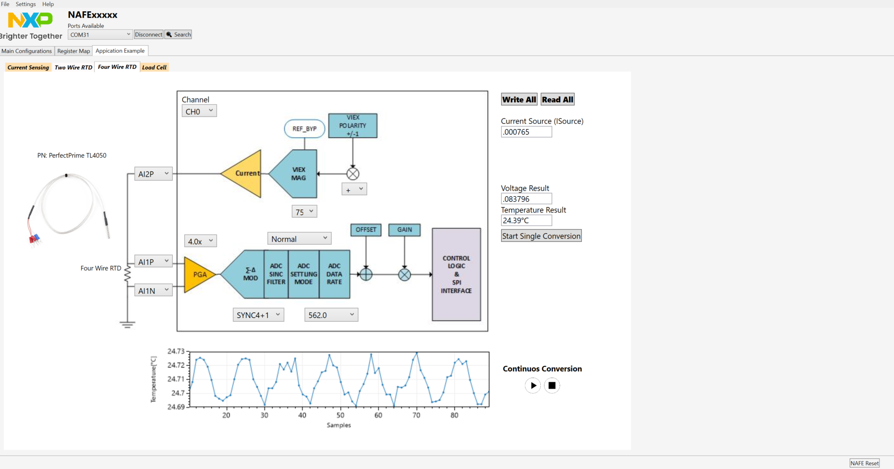](4_WRTD_normal_water_Test.png)

    - Readings when dipped in cold water:
        - Hardware setup:

         

        - Result after conversion:
        
         [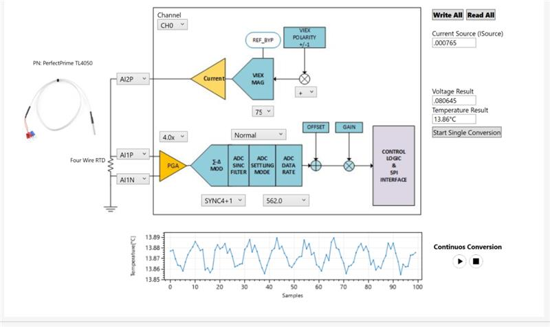](4_WRTD_cold_water.jpeg)
        
- **Note:** A 4-wire RTD is better because it eliminates the influence of lead wire resistance, providing more accurate temperature measurements. The difference of around 3°C between 2-wire and 4-wire RTDs arises because the 2-wire setup includes lead resistance in the measurement, causing higher temperature errors.

#### 4.6 On Board RTD 

- Reading voltage across On Board RTD powered by NAFE13388 REF_BYP using single channel continuous reading conversion.
- In this application the internal signal input GPIO0-1 is used to read the RTD reference temperature and buffered voltage reference (REF_BYP) is used to excite the RTD voltage divider.
- Conversin method followed: SCCR conversion.
- Follow either manual register configuration or configuration using json for register configuration.
- Perform all the register configurations and then press "Start Single Conversion" button
or press "Continuous Conversion" button to plot graph according to the continuous conversion sampled values.
- Manual register configuration:
    - Channel configuration registers (bit fields) to be set as given below:

        - CH_CONFIG0: 
            - HV_AIP: 10
            - HV_AIN: 10
            - LVSIG_IN: 1

        - CH_CONFIG1:

            - CH_CAL_GAIN_OFFSET: 10
            - ADC_DATA_RATE: 19
            - ADC_SINC: 1

        - CH_CONFIG2:  
            - CH_DELAY: 19
        
- Register configuration using json:
    - Use [on_board_rtd.json](./import_export_test_json/on_board_rtd.json) to import register and channel settings for SCCR conversion and then press the Write All button of both the channel registers and system registers to write all the registers at once.
- Connect external voltage source to J89, with the GND connecetd to pin 1 and +15V connected to pin 2 of J89.
- Hardware Connections:
  
     [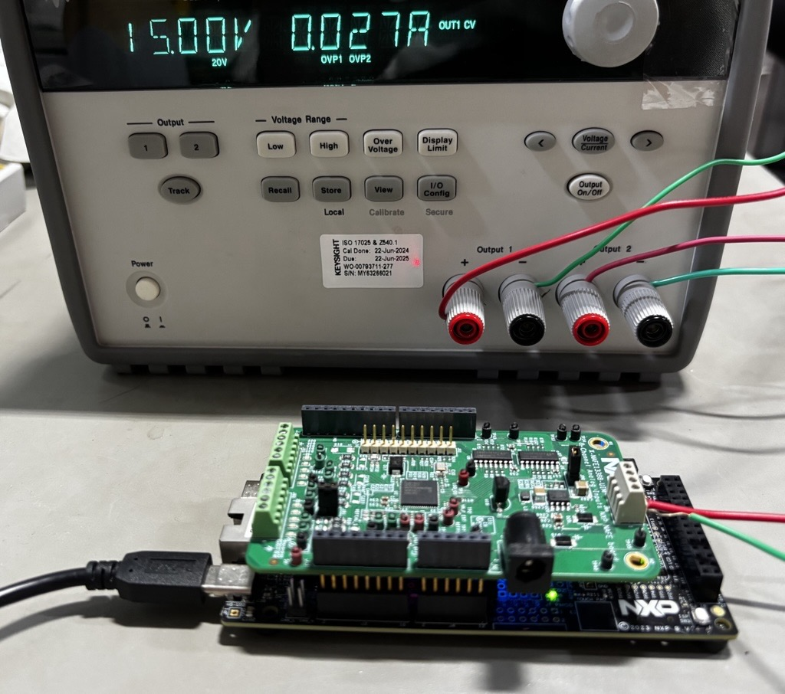](ORTD_Setup.jpeg)

- Result:
  
    [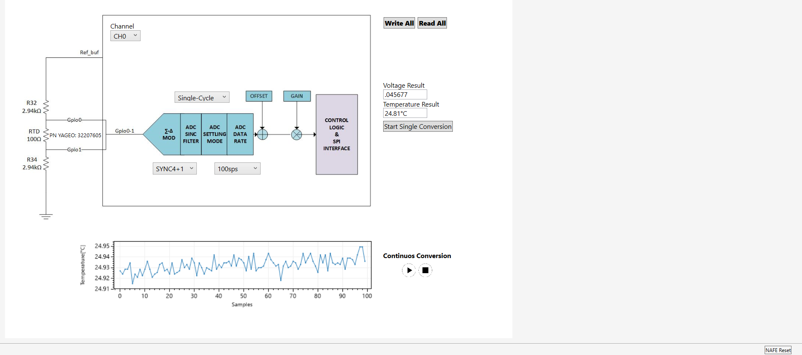](On_Board_RTD.png)
      
    
#### 4.7 Weight scale 

- 
  <b> Weight scale (load cell): </b> Calibration and reading procedure of a load cell, the load cell excitation is generated by the NAFE integrated VIEX, the conversion is performed using single channel continuous readings conversion. 

- 
A load cell is a transductor used to translate mechanical force, such as weight, into measurable quantity. Load cells are usually composed of a strain gauge positioned on an elastic element. The elastic element is usually made of steel, so it is strong, but also has some elasticity. The minute variations on the spring element can be detected with strain gauges. The strain of the strain gauge is then converted by the electronics (ADC + excitation circuit) to determine the weight. 

- 
 In a load cell, a wheatstone bridge structure is used to transform a resistance value to a voltage value. The wheatstone architecture utilizes a strain gauge in place of resistors. AI2P of the NAFE is used as output voltage, while AI1P and AI1N are used to sense the voltage across the bridge. 

     

- 
 This application needs a voltage excitation source and two input channels to sense the voltage. Use a slow data rate and a higher gain configuration to improve the quality of reading as the sense voltage range will be in the order of mV. 

- Conversion method followed: SCCR conversion.

- Perform all the register configurations and then press **Start Single Conversion**
or press "Continuous Conversion" button to plot a graph according to the continuous conversion sampled values.

- Follow either manual register configuration or configuration using json for register configuration. 

- Manual register configuration:
    - Channel configuration registers (bit fields) to be set as given below:

        - CH_CONFIG0: 
            - HV_AIP: 1
            - HV_AIN: 1
            - CH_GAIN: 7
            - HV_SEL: 1
            - LVSIG_IN: 2

        - CH_CONFIG1:

            - CH_CAL_GAIN_OFFSET: 7
            - ADC_DATA_RATE: 20
            - ADC_SINC: 1

        - CH_CONFIG2:  
            - CH_DELAY: 11 
            - ADC_NORMAL_SETTLING: 1
        
        - CH_CONFIG3:
            - VIEX_VI: 0
            - VIEX_MAG: 13
            - VIEX_AIP_EN: 2
            - VIEX_AIN_EN: 0
- Register configuration using json:
    - Use [ws.json](./import_export_test_json/ws.json) to import register and channel settings for SCCR conversion and then press **Write All** of both the channel registers and system registers to write all the registers at once.

- Connections guide for weighing scale:

    - 
 Connect red and black wires of the load cell to AI2P and AICOM respectively for forcing 6 volts excitation voltage to AI2P. 

    - 
 Connect AI1P-AI1N with green and white wires respectively to sense differential voltage acrross which is required for weight calculation. 

- 
 **Need of 6 V excitation voltage:** A 6 V excitation voltage is required for a load cell to provide a stable and consistent voltage to the strain gauges. This excitation voltage powers the strain gauges and ensures that any changes in their resistance due to applied force result in measurable voltage changes. Higher excitation voltage, like 6 V, improves the signal-to-noise ratio, enhancing the accuracy and resolution of the weight measurement. It also ensures the strain gauges operate within their optimal range for precise and reliable performance. 

- Three-step process to calibrate and measure weight of any object:
   
    1. Offset calculation: Firstly, sense the voltage across load cell without putting any weight, resulting voltage should be stored as offset.
    2. Calibration coefficient calculation: Calibrate the load cell with known weight and store the value of calibration coefficient as follows:

        - calibrationCoeff = (knownWeight)/(ConversionResult-Offset)
    3. Now any weight can be measured, by voltage conversion read by the ADC (Vadc):
        
        - Weight = calibrationCoeff * (Vadc - Offset)

- Step 1: Offset calculation (without any weight):

    - Click on the **Calibration** button to perform offset reset.

        [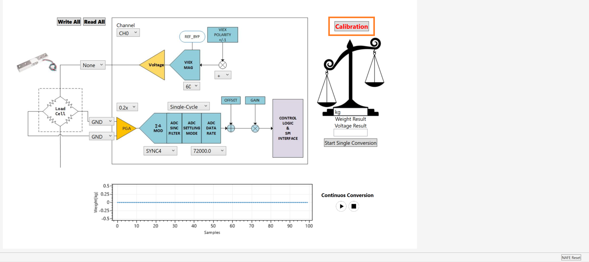](Cal_Button.png)

    - Leave the load cell (weight scale) wuithout any weight for offset calculation.
        
	

    - Click **Measure** in step 1 to perform offset reset.

        [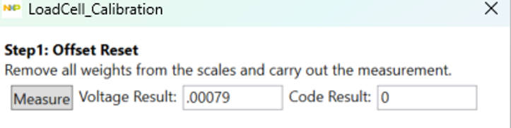](offset_calc.PNG)

- Step 2: Calculation of calibration coefficient by calibrating the weight scale with known weight (303g in this case):

    - Perform the calibration in Step 2 of the Calibration tab to calculate the calibration coefficient by adding any known weight.
        
	[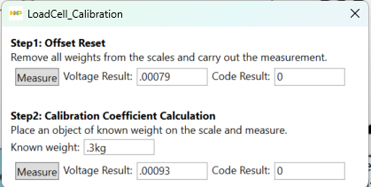](Calibration_ws.png)

    - Known weight calculation using actual weight scale.

        
    - Putting actual weight on scale to perform calibration.

        [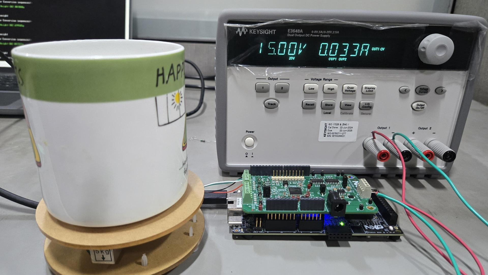]( mugWeightScale_LoadCell.jpg)

    - Weight after calibration (303 g)

        [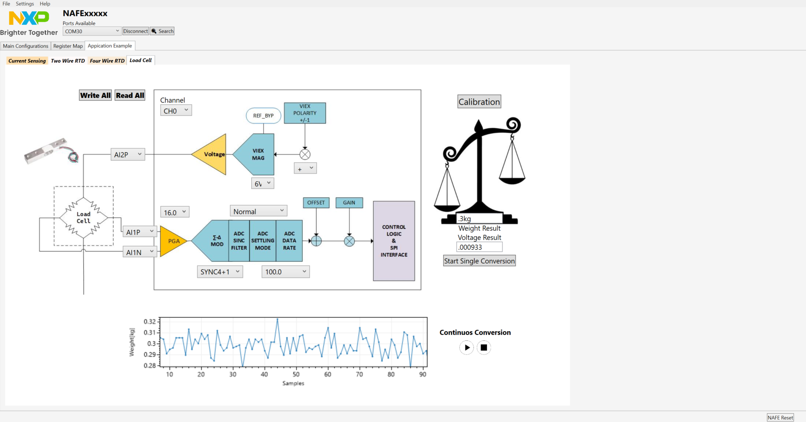](WS_1_Test.png)

- Step 3: Actual weights calculation (289 g in this case):

    - Put different weight (289 g in this case).

        

    - Weight gets calculated as given below:

         [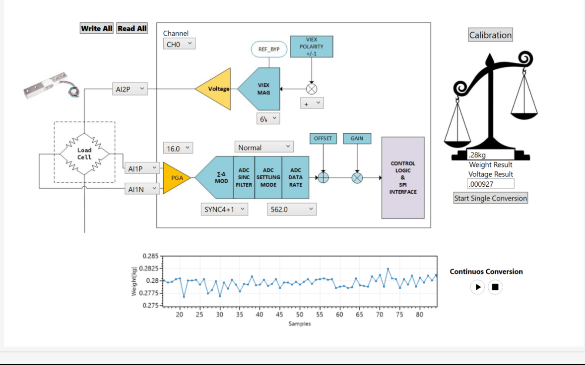](WS_2_Test.png)

   
